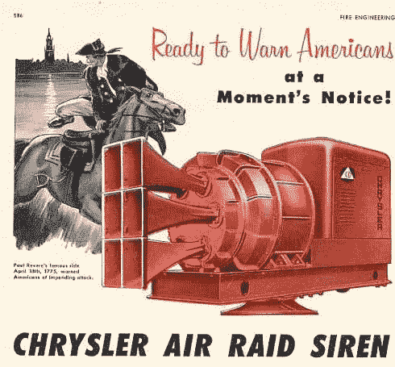

<!--yml

category: 未分类

date: 2024-05-18 18:57:21

-->

# VIX and More: Schaeffer Thinks VIX May Be Signaling ‘All Clear’

> 来源：[`vixandmore.blogspot.com/2007/10/schaeffer-thinks-vix-may-be-signaling.html#0001-01-01`](http://vixandmore.blogspot.com/2007/10/schaeffer-thinks-vix-may-be-signaling.html#0001-01-01)

在今天发布的[周一晨间展望：小盘股情绪与 VIX 的大幅波动](http://www.schaeffersresearch.com/commentary/observations.aspx?ID=20478&c=berniefeed)中，Bernie Schaeffer 认为，上周 VIX 收盘价低于 32 周简单移动平均线，可能发出了与 2006 年 8 月类似 VIX 收盘价所发出的“一切安好”的信号。

在[SPX-VIX 相关性](http://vixandmore.blogspot.com/search/label/SPX-VIX%20correlation)方面，Schaeffer 也研究了上周五的市场动作，并指出“SPX 上涨超过 0.85%，而 VIX 下跌不到 10% - 自 1990 年以来，这种走势在历史上具有看涨的含义。具体来说，在接下来的 20 天内，市场有 69%的时间处于上涨状态；在此期间，SPX 的平均涨幅为 1.65%。”

顺便说一下，读者可能感兴趣的是，我在博客的右侧栏提供了几个重要人士链接，这些人经常谈论 VIX 和市场情绪。这些“其他重要声音”的链接可以在“我经常访问的博客”部分下方找到，目前包括 Bernie Schaeffer、Larry Connors、Fred Ruffy、Jay Kaeppel 和 Mark Hulbert 等人的链接。
