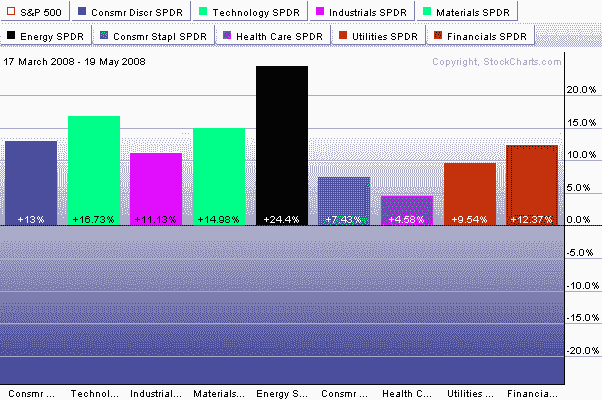
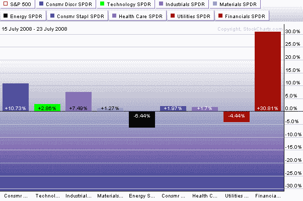
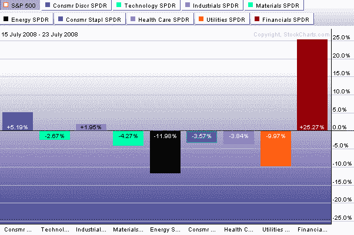

-   <!--yml

category: 未分类

date: 2024-05-18 18:31:27

-   -->

# -   VIX and More: Sector Performance in the Last Two Bull Moves

> 来源：[`vixandmore.blogspot.com/2008/07/sector-performance-in-last-two-bull.html#0001-01-01`](http://vixandmore.blogspot.com/2008/07/sector-performance-in-last-two-bull.html#0001-01-01)

-   过去几天，我一直收到关于板块的问题，尤其是关于石油和能源的。在我的大部分回复中，我都对 3 月份到 5 月份的牛市行情和 7 月 15 日触底后的最新行情进行了比较。由于我很少重发我的[订阅者新闻通讯](http://vixandmoresubscriber.blogspot.com/)中的内容，我认为这是一个很好的借口，剪切并粘贴周三新闻通讯中关于板块的部分：

> -   让我回顾一下从 SPX 1256 到 SPX 1440 的 3 月份到 5 月份的行情，涨幅为 184 点。如板块分解（顶部图表）所示，各板块的参与度普遍很高。有趣的是，能源是表现最好的板块，其次是技术和材料。金融板块处于中游。
> 
> -   快进到过去六天的交易，现在 SPX 比低点高出 82 点。这不到 3 月份到 5 月份行情的半程，但对于一周多的工作来说，表现已经相当令人印象深刻了。注意当前反弹中（中间图表）板块分解看起来有何不同。金融板块推动最近行情的程度令人印象深刻，尽管有些不平衡。注意在当前反弹中，只有金融板块的百分比涨幅超过了 3 月份到 5 月份的行情。事实上，除了金融板块，只有工业和消费者可选板块在最近的行情中至少获得了早先行情一半以上的涨幅。其他所有板块的涨幅都在 3%或以下，能源和公用事业板块显示了亏损。
> 
> -   底部图表使用了与中间图表相同的数据，只不过百分比涨跌是扣除标普 500 指数表现后的结果。这证实了金融板块是真正推动 SPX 波动的唯一板块。消费者可选板块提供了一小波助力，工业板块勉强超过了 SPX，但如果没有金融板块的参与，这波反弹将呈现出截然不同的面貌和感觉。

-   
