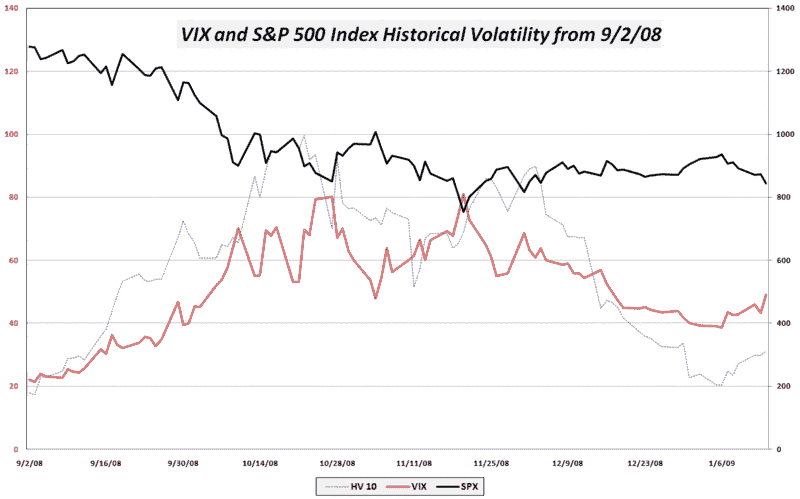

<!--yml

分类：未分类

日期：2024-05-18 18:06:02

-->

# VIX 和更多：当前环境下的裸看跌期权出售

> 来源：[`vixandmore.blogspot.com/2009/01/selling-naked-puts-in-current.html#0001-01-01`](http://vixandmore.blogspot.com/2009/01/selling-naked-puts-in-current.html#0001-01-01)

在我的最近[三部曲](http://vixandmore.blogspot.com/2009/01/more-on-put-returns.html)关于[看跌期权写作](http://vixandmore.blogspot.com/search/label/put-write)策略中，我的意图是识别一个在非趋势市场中表现良好的方法。尽管我仍然相信我们被困在标普 500 指数大约 820-980 的范围内，但涉及出售看跌期权的方法在定义良好的交易区间的底部时通常表现最佳。简而言之，当前情况看起来是写一些现金担保看跌期权的绝佳时机。

有几个因素表明，目前可能是出售看跌期权的好时机。随着市场开盘今晨 VIX 再次超过 51，并且大多数短期[历史波动率](http://vixandmore.blogspot.com/search/label/historical%20volatility)（如图表下的 10 日 HV）显示 VIX 远高于我们过去几周实际经历的市场波动率，一个可能的结论是，当前水平的波动率被高估了。此外，在我写下这些内容时，SPX 正好在 830，我们正处于 SPX 交易区间的底部，820-830 区间可能有重要的支撑。

最后，最近新闻流动一直很负面，从金融股到零售商，从史蒂夫·乔布斯到全球贸易等。这种更大的恐惧和焦虑成分开始渗透到像 VIX 这样的[隐含波动率](http://vixandmore.blogspot.com/search/label/implied%20volatility)指标中。

对于那些想要限制风险的人来说，针对一组股票的指数或 ETF 的现金担保看跌期权可以帮助消除单一股票的下行风险。那些有兴趣限制写看跌期权风险的人可能更愿意考虑[牛市看跌价差](http://vixandmore.blogspot.com/search/label/bull%20put%20spread)，在这种策略中，作者出售一个接近价钱的看跌期权并购买另一个远离价钱的看跌期权以限制损失。

来源：[VIX 和更多](http://vixandmore.blogspot.com/)
