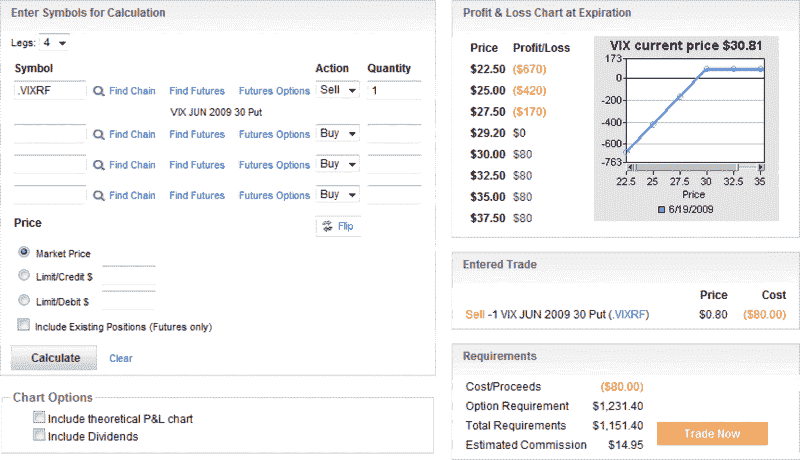

<!--yml

类别：未分类

日期: 2024-05-18 17:42:34

-->

# VIX and More：在到期前裸卖 VIX 看跌期权

> 来源：[`vixandmore.blogspot.com/2009/06/selling-vix-puts-pre-expiration.html#0001-01-01`](http://vixandmore.blogspot.com/2009/06/selling-vix-puts-pre-expiration.html#0001-01-01)

在到期前裸卖[看跌期权](http://vixandmore.blogspot.com/search/label/naked%20put)对波动率指数来说是一种令人惊讶地低风险的波动性交易。

通常，裸卖看跌期权是一种危险的策略，因为负面消息可能会压倒底层资产，导致其跳空下跌并造成巨大损失。然而，对于波动率指数来说，飙升几乎总是向上的，因为尽管股票面临的威胁相对容易识别，但要突然消除这些威胁则更加困难。

因此，出于这个原因，以及因为波动率指数最近显示出一些不愿跌破 27 的迹象，裸卖波动率指数看跌期权比裸卖其他证券要少得多的风险。向下的风险绝对受限，但限制并不能完全数学量化。

6 月 30 日看跌期权的出售展示了一种潜在的裸卖看跌期权的机会。下面的盈亏图表概述了这项交易的情况。根据昨日收盘价 30.81，如果波动率指数（VIX）上涨、横向漂移或在明天的[特别开盘行情](http://vixandmore.blogspot.com/search/label/VIX%20SOQ)之前下跌最多 1.61，则这笔交易是盈利的。每份合约的收益为 80 美元。盈亏图表显示，每份合约的损失发生在 27.50。假设 27.00 是 VIX 的底部，则最大损失可能被限制在 220 美元。虽然一天内波动率指数下跌 12.3% 的情况不能完全排除，但显然这不是一个很有可能发生的情景。

提醒：VIX 期权在周三到期。本轮 6 月的 VIX 期权将于 6 月 17 日到期。这些期权的最后交易日是今天，即 6 月 16 日。 （更多 2009 年期权到期日期，请参见 [2009 年期权到期日历](http://www.theocc.com/publications/xcal/xcal2009.pdf)。）

*[来源：optionsXpress]*

***披露****：在撰写本文时，通过期权持有 VIX 的中性头寸。*
