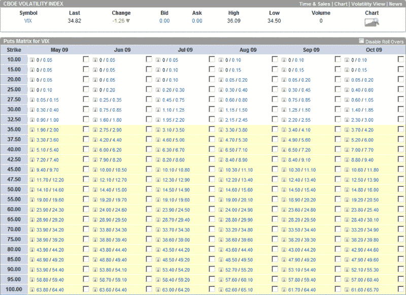

<!--yml

类别：未分类

日期：2024 年 05 月 18 日 17:49:38

-->

# VIX and More: 利用看跌期权矩阵出售 VIX 看跌期权

> 来源：[`vixandmore.blogspot.com/2009/04/selling-vix-puts-with-help-of-put.html#0001-01-01`](http://vixandmore.blogspot.com/2009/04/selling-vix-puts-with-help-of-put.html#0001-01-01)

当 SPX 在将近两个月前形成其“[魔鬼底部](http://vixandmore.blogspot.com/search/label/devil%27s%20bottom)”时，VIX 为 51.65。自那时以来，SPX 上涨了几乎正好三分之一，VIX 下降了几乎正好三分之一。随着 SPX 持续上涨——最近突破了重要的阻力水平 875——VIX 似乎不太愿意继续下降。这与我[两周前的声明](http://vixandmore.blogspot.com/2009/04/some-vix-milestonesand-prediction.html)一致，“我个人的预测是，波动率的最近下降将在下降到 30-32 水平之前不会再降低。”

波动率下限并不一定意味着 VIX 必定会再次飙升至 50。然而，这确实意味着一些有趣的[VIX 期权交易](http://vixandmore.blogspot.com/search/label/VIX%20options)可能会出现。例如，如果你认为 VIX 不太可能保持在 35 以下，你可以卖出 VIX 看跌期权，并在几乎没有下行风险的情况下获得相当数量的保费。虽然“几乎没有”是一个主观的术语，但 VIX 看跌期权比其他裸卖看跌期权的风险要小，因为虽然波动率有上涨的趋势，但下跌的路径（除了向上的急涨）几乎总是渐进的。

有了这个想法，我想要强调一下 optionsXpress 网站上的一个期权矩阵功能。客户可以为任何可期权化的证券创建一个看涨或看跌期权矩阵，并以矩阵格式查看未来六个月内的出价和询价价格。下图显示了从五月到十月的所有行权价为 10 到 100 的 VIX 看跌期权。

如果你仔细研究图表，就能看到大量有趣的信息。关于 VIX 看跌期权底部的可能性，你可以看到它的定价。目前，五月份的 VIX 35 行权价看跌期权的卖出价为 1.90，而六月份的则为 2.75。然而，进一步延长时间，则在增量保费方面几乎没有任何东西。七月份的 35 行权价的出价为 3.10，八月份的为 3.30，九月份的为 3.40，依此类推。

为了增加一些乐趣，可以查看 60 行权价看跌期权的出价。从五月到十月，它们几乎每个月都是一样的。为什么？部分答案是，均值回归被内置到期权价格中。

VIX 期权有一些有趣的怪癖，大多数投资者需要一段时间才能内化。然而，通过查看看跌期权矩阵或看涨期权矩阵，更容易了解 VIX 期权价格中内置了哪些类型的未来 VIX 波动。

*[来源：optionsXpress]*

***免责声明***：撰写时持有 VIX 多头头寸。
