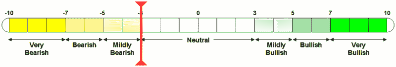

<!--yml

类别：未分类

date: 2024-05-18 18:55:05

-->

# VIX 和更多：金融股抛售震动 VIX;VWSI 为-3

> 来源：[`vixandmore.blogspot.com/2007/11/selloff-in-financials-jolts-vix-vwsi-at.html#0001-01-01`](http://vixandmore.blogspot.com/2007/11/selloff-in-financials-jolts-vix-vwsi-at.html#0001-01-01)

美联储降息了 0.25%，但在随后的 2 ½天里，投资者卖出的比买入的多，推动 VIX 上涨 3.45 点（17.6%）至当周末的 23.01 点，这是七周以来 VIX 收盘价最高。

商业银行和其他金融股帮助增加了投资者的焦虑，[花旗集团(C)](http://finance.google.com/finance?q=c)和[美林证券(MER)](http://finance.google.com/finance?q=mer)引起了大部分的担忧。对于本周的总结以及可能接下来的周报，我强烈推荐阅读[巴里·里瑟尔茨](http://bigpicture.typepad.com/)在[大图景](http://bigpicture.typepad.com/)上整理的内容（我想我会在我的周度 VWSI 更新中让这些链接成为一项常规特色）：

转向 VWSI，波动性的增加帮助推动指针在周末达到 VWSI -3。上次 VWSI 在周末收盘价为-3 是在 2007 年第一周，当时 VIX 的“尖峰”达到 12.14，最初看起来像是一个异常，因为接下来的七周 VIX 收盘价都在 10 多一点到 11 低一点之间。当然，一切都在 2 月 27 日那天爆发了，从那时起，投资环境就大不相同了。我没有理由预测当前的-3 读数可能出现在类似的关头，但回顾最近的历史并试图想象当前市场镜头与已经过时的那个有何不同总是富有教益的。

*（请注意，在上面的温度计中，“看涨”和“看跌”的标签适用于 VIX，而不是更广泛的市场，后者通常与 VIX 呈负相关。）*

*****葡萄酒搭配：*** 对于 VWSI 为-3，我建议选择一种多才多艺的轻型红葡萄酒。不，不是[博若莱](http://en.wikipedia.org/wiki/Beaujolais)（尽管另一种[博若莱新酒](http://en.wikipedia.org/wiki/Beaujolais_nouveau)的发布日期即将到来）或者这款酒的葡萄[佳美](http://en.wikipedia.org/wiki/Gamay)。不，也不是[黑皮诺](http://vixandmore.blogspot.com/search/label/pinot%20noir)。相反，我推荐新旧结合：一种[巴贝拉](http://en.wikipedia.org/wiki/Barbera)。这种葡萄在意大利广泛种植，并经常被用作混合葡萄，既在意大利，也在美国。

虽然<country-region st="on"><place st="on">意大利</place></country-region>确实产出了最知名的巴贝拉葡萄酒，比如[巴贝拉·达斯特](http://en.wikipedia.org/wiki/Barbera_d%27Asti)和[巴贝拉·达阿尔巴](http://en.wikipedia.org/wiki/Barbera_d%27Alba)，但是来自[ Sierra Foothills](http://www.foothillwine.com/)的这款葡萄酒，口感鲜美，极适合饮用，最近深深地吸引了我：2005 年的[ Renwood](http://www.renwood.com/) Sierra 系列巴贝拉。如果你正在寻找一种不同的葡萄品种来添加到你日常饮用的红酒列表中，这款酒值得一试。在我家附近的葡萄酒商店只需 9 美元，性价比高，是一个很好的选择。

如果你对意大利的巴贝拉葡萄酒感兴趣，想了解一些既娱乐又有趣的信息，我建议你看看 Gary Vaynerchuk 在 Wine Library TV 的节目，具体可以观看[巴贝拉葡萄酒专辑](http://tv.winelibrary.com/2007/11/08/the-barbera-episode-episode-347/)。**
