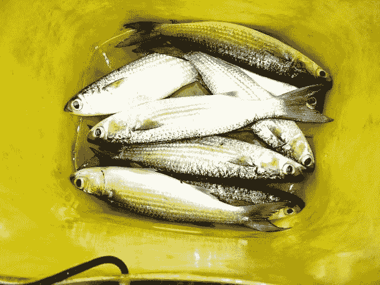

<!--yml

分类：未分类

日期：2024-05-18 18:44:26

-->

# 《VIX 和更多》：情绪失败

> 来源：[`vixandmore.blogspot.com/2008/02/sentiment-failures.html#0001-01-01`](http://vixandmore.blogspot.com/2008/02/sentiment-failures.html#0001-01-01)

我认为，失败通常比确认提供更多重要的信号。例如，如果一家公司报告了好消息但股价下跌，那么这个行动比股票在消息发布时弹跳更有说服力（尽管有所有“传言买入，消息卖出”的传说。）对市场数据和更广泛的指数来说也是如此。在我看来，这些都是基本面的失败。

技术分析中也存在类似的情况。在这种背景下，失败可能指的是某只股票或指数一直都在某个特定的支撑水平上弹跳，但现在违反了这一支撑并继续下跌。我相信，这些技术分析的失败在信息含量上远比支撑位第 n+1 次守住要重要得多。

这使我们想到了昨天。特别是两项指标表明市场情绪极为负面，以至于反弹成为一个高概率事件：[ISEE](http://vixandmore.blogspot.com/search/label/ISEE)刚刚在其 20 天移动平均线上创下了新低，而[纳斯达克 TRIN](http://vixandmore.blogspot.com/2008/02/bullish-nasdaq-trin-signal.html)（30 天指数移动平均）激增至 2002 年以来的水平。底线是，对于多头来说，反弹应该像在鱼缸里射击鱼一样容易。由于多头既无法保住他们的收益，也无法对随之而来的抛售造成任何损害，我被迫得出结论，在这种重大的情绪失败过程中，他们甚至没有碰到任何鱼。我还把我的偏见改为空头，直到多头能展示出一点射击技巧……
