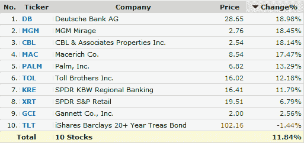

<!--yml

分类：未分类

日期：2024-05-18 17:56:21

-->

# VIX 和更多：空头回补推动今日涨幅

> 来源：[`vixandmore.blogspot.com/2009/03/short-covering-driving-todays-gains.html#0001-01-01`](http://vixandmore.blogspot.com/2009/03/short-covering-driving-todays-gains.html#0001-01-01)

确定熊市反弹背后有多少空头回补的一个最佳方法是创建一个包含许多具有大量未偿还[空头兴趣](http://vixandmore.blogspot.com/search/label/short%20interest)的股票和 ETF 的投资组合。

为了在未来的反弹中梳理出空头回补的活动，我昨天组建了一个这样的投资组合，利用了[Finviz.com 筛选器](http://finviz.com/screener.ashx)来识别短线交易中空头占比较大的高成交量证券。

结果如下，显示这个投资组合中的十只股票今天半程的平均涨幅为 11.8%，这表明空头回补推动了今天大部分的反弹。注意有 7 只 10 只持股今天的涨幅超过了 11%，其中领头的是德意志银行([DB](http://vixandmore.blogspot.com/search/label/DB))和米高梅([MGM](http://vixandmore.blogspot.com/search/label/MGM))。

来源：[FINVIZ.com]*
