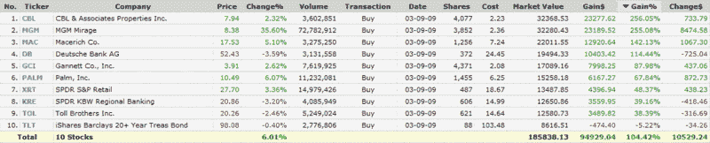

<!--yml

category: 未分类

date: 2024-05-18 17:49:24

-->

# VIX 和更多：空头回补的上涨数据点

> 来源：[`vixandmore.blogspot.com/2009/05/short-covering-rally-data-points.html#0001-01-01`](http://vixandmore.blogspot.com/2009/05/short-covering-rally-data-points.html#0001-01-01)

3 月 9 日，我组建了一个包含十只流动性极高的股票和 ETF 的投资组合，这些股票和 ETF 持有极端的[空头头寸](http://vixandmore.blogspot.com/search/label/short%20interest)。第二天早晨，我在[空头回补推动今日涨幅](http://vixandmore.blogspot.com/2009/03/short-covering-driving-todays-gains.html)一文中提到了这个投资组合。

我认为这是分享这些持有大量空头的股票和 ETF 在过去 7 ½周内的表现的好时机。我从[Finviz.com](http://finviz.com/)获取了下面的图表，展示了投资组合的表现。作为一个债券 ETF，[TLT](http://vixandmore.blogspot.com/search/label/TLT)可能不应该在这个组中，但由于我将其包含在原始投资组合中，所以我现在还留在这里。值得一提的是，从投资组合中移除 TLT 会使总回报率提高到 116.60%。显然，近期的大部分涨幅来自于对德意志银行([DB](http://vixandmore.blogspot.com/search/label/DB))、米高梅度假村([MGM](http://vixandmore.blogspot.com/search/label/MGM))和购物中心 REITs Macerich([MAC](http://vixandmore.blogspot.com/search/label/MAC))以及 CBL & Associates([CBL](http://vixandmore.blogspot.com/search/label/CBL))等公司的空头回补。

*[source: FINVIZ.com]*
