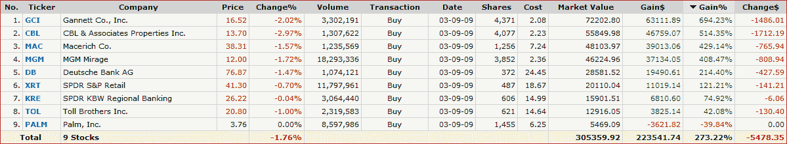

<!--yml

类别：未分类

date: 2024-05-18 17:12:27

-->

# VIX 和更多：一年后的做空压力组合

> 来源：[`vixandmore.blogspot.com/2010/03/short-squeeze-portfolio-one-year-later.html#0001-01-01`](http://vixandmore.blogspot.com/2010/03/short-squeeze-portfolio-one-year-later.html#0001-01-01)

**回顾起来，2009 年 2 月我大概是个傻瓜，而在 3 月则成了天才。** 从远处看，当我试图预测市场底部时，这通常就是它的样子。

当然，任何拿着飞镖和股票列表的人都能构建一个一年前就能带来至少 60%回报的投资组合，但棘手的是，许多人都不愿意扣动扳机。

幸运的是，当市场可能触底的第一丝迹象出现时，我幸运地从大量被极度做空的股票中钓鱼，并组建了一个至少 30%的流通股被做空、股票平均交易量至少为 500 万股的投资组合。我首次在这些想法中透露是在 2009 年 3 月 10 日的[短线回补推动今日收益](http://vixandmore.blogspot.com/2009/03/short-covering-driving-todays-gains.html)，后来在 2009 年 5 月 1 日的[短线回补反弹数据点](http://vixandmore.blogspot.com/2009/05/short-covering-rally-data-points.html)中讨论了该组合的表现，此时平均持仓已经翻了一番多。

现在，一年多一点之后，四个持仓股（[GCI](http://vixandmore.blogspot.com/search/label/GCI)，[CBL](http://vixandmore.blogspot.com/search/label/CBL)，[MAC](http://vixandmore.blogspot.com/search/label/MAC)，[MGM](http://vixandmore.blogspot.com/search/label/MGM)）的涨幅超过了 400%。两个落后的是 PALM，下跌了近 40%，而长期债券 ETF [TLT](http://vixandmore.blogspot.com/search/label/TLT) 下跌了 10%（考虑分红后），并且下方的股票和股票 ETF 图表中省略了它的数据。

我相信其中一些之前的做空压力候选股仍有一些上涨空间，但在我下一篇文章中，我将看看一些当前[做空兴趣](http://vixandmore.blogspot.com/search/label/short%20interest)浓厚的股票，看看这次做空者是否有利。

关于相关主题的更多信息，读者可以查阅：

**[来源：FINVIZ.com]**

**披露：** *写作时持有 MAC、DB 和 XRT*
