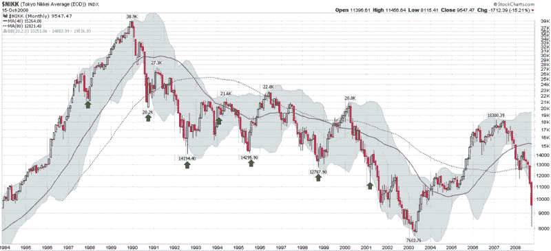

<!--yml

分类：未分类

日期：2024-05-18 18:19:16

-->

# VIX 和更多：在波动极端时你应该做多吗？看看日经 225

> 来源：[`vixandmore.blogspot.com/2008/10/should-you-go-long-at-volatility.html#0001-01-01`](http://vixandmore.blogspot.com/2008/10/should-you-go-long-at-volatility.html#0001-01-01)

日经 225 股票指数是用来追踪东京证券交易所的主要指数。它也是记录日本股市从 1989 年 12 月 31 日的 38,959 跌至 2003 年 4 月的 7,603，跌幅超过 13 年超过 81%的指数。

因此，日经指数提供了一个机会，来测试在极端波动时是否启动新的多头头寸是有利可图的，甚至在长期熊市中。

为了测试这个假设，我回顾了从 1984 年至今的日经 225 的数据，并挑选出了这期间最波动的十天，使用了各种波动性指标，如[历史波动性](http://vixandmore.blogspot.com/search/label/historical%20volatility)和[平均真实范围](http://vixandmore.blogspot.com/search/label/average%20true%20range)。结果包括了许多重叠的日子和类似波动极端的群聚，以下图表图形地展示了这些结果，由 Stockcharts.com 提供。在图表中，波动性水平最高的七个实例被绿色箭头突出显示。注意，在每一个案例中，至少跟随了这两个月的反弹。在唯一的一个牛市例子中，新的看涨趋势持续了两年；在所有其他的熊市例子中，新的看涨趋势持续从两个月到一年半不等。

记录在案，日经在过去两周的行动使当前环境成为所有实例中最波动的，正如标普 500 当前的情况一样。

虽然所有的熊市都不是一回事，但日本的“[失落的十年](http://www.minneapolisfed.org/research/wp/wp607.pdf)”与美国的某些问题有相似之处。从全球视角审视历史记录，很自然会得出结论，当前的情况至少会引发另两个月的波动反弹。

来源：[StockCharts]
