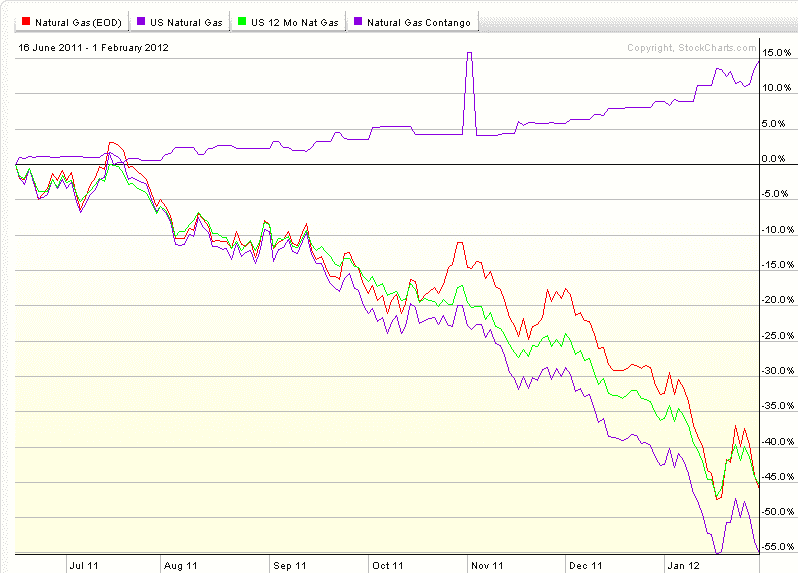

<!--yml

分类：未分类

日期：2024-05-18 16:41:33

-->

# VIX 和更多：屠龙天然气正向市场

> 来源：[`vixandmore.blogspot.com/2012/02/slaying-natural-gas-contango-dragon.html#0001-01-01`](http://vixandmore.blogspot.com/2012/02/slaying-natural-gas-contango-dragon.html#0001-01-01)

昨天关于[天然气、正向市场和 UNG](http://vixandmore.blogspot.com/2012/02/natural-gas-contango-and-ung.html)的帖子似乎引起了一大批读者的广泛关注，所以作为一个 encore，我决定放弃典型的[令人眼花缭乱的 Liszt 小品](http://www.youtube.com/watch?v=hEnfZjqMSy0)收藏，直接跳到更多关于如何从天然气市场中持续的正向市场和负向滚动收益率中获利的讨论。

从下面的图表开始，我绘制了自 2011 年 6 月 16 日以来天然气(红色线)和三个天然气 ETP 的表现：

+   美国天然气基金([UNG](http://vixandmore.blogspot.com/search/label/UNG))——蓝色线

+   美国 12 个月天然气基金([UNL](http://vixandmore.blogspot.com/search/label/UNL))——绿色线

+   瑞银 ETRACS 天然气期货正向 ETN([GASZ](http://vixandmore.blogspot.com/search/label/GASZ))——粉红色线

图表从 2011 年 6 月开始的原因是它标志着 GASZ 的推出；另外两个 ETP 有更长的跟踪记录。

首先，请注意 UNG 并没有试图最小化其对正向市场的暴露。像许多其他基于期货的 ETP 一样，它的目标是保持组合中一个月加权平均到期 maturity，并通过购买第二个月期货和出售最近一个月期货来实现。UNL 是在 UNG 之后推出的，是同一发行人试图通过持有 12 个月的天然气期货合约来最小化正向市场的一次尝试，假设正向市场在期货曲线的最前端最陡，而在更远期的月份则较为平坦。如下面的图表所示，UNG 和 UNL 之间的近期表现差异几乎没有。

瑞银 ETRACS 产品 GASZ 采取了一种完全不同的方法，基于天然气期货价差指数，做空最近一个月，做多一些更远期的月份。换句话说，这个 ETP 专门设计用来利用正向市场。根据瑞银的说法：

> *“ISE 天然气期货价差™指数通过一系列对天然气子指数的投资，有效地提供了短期天然气期货合约的做空曝光和中期天然气期货合约的多头曝光。这通过建立 100%的多头头寸在 ISE 短期前月天然气期货™指数的组成部分来实现，该指数为 ISE 长期前月天然气期货™指数提供做空（或反向）曝光，以及在 ISE 第十二月天然气期货™指数、ISE 第十三个月天然气期货™指数和 ISE 第十四个月天然气期货™指数（每个指数 33.33%）的组成部分中总共建立 100%的多头头寸，这些指数为中期亨利枢纽天然气期货（NG）期货合约提供多头曝光。该指数每月在子指数滚动过程之前进行再平衡，以保持 1:1 的比例。”*

更多信息，请访问[GASZ 网站](http://www.ibb.ubs.com/mc/etracs_US/alpha/gas.shtml)和[招股说明书](http://www.ibb.ubs.com/mc/etracs_US/downloads/futures_prospectus.pdf)。

至少从下面的图表来看，GASZ 方法在过去八个月中显示出一些希望。公平地说，GASZ 的交易量非常小，还没有激发广泛的投资者兴趣，但这里是一种不太可能与投资者目前运行的任何策略相关联的方法，并且在股市横向（至少对股票而言）市场中一直在积累利润。

当然，投资者总是可以做空 UNG，但我相信，正如[ZIV 被不公正地忽视](http://vixandmore.blogspot.com/2012/01/ziv-undeservedly-neglected.html)作为反向 VIX 期货价差交易一样，GASZ 也因同样的原因被忽视。这两个 ETP 有很多潜力，应该有更广泛的受众。

最后，作为一条侧注，UNG 昨日宣布，将于 2 月 21 日市场关闭后进行 1-4 的反向分割。这是一个在过去三年中每年下跌超过 40%，并且在 2012 年已经下跌超过 21%的产品。不要惊讶，这可能不是最后一次反向分割。

相关文章：

*来源：[StockCharts.com]*

****披露：**** *在撰写本文时，持有 GASZ 和 ZIV，做空 UNG*
