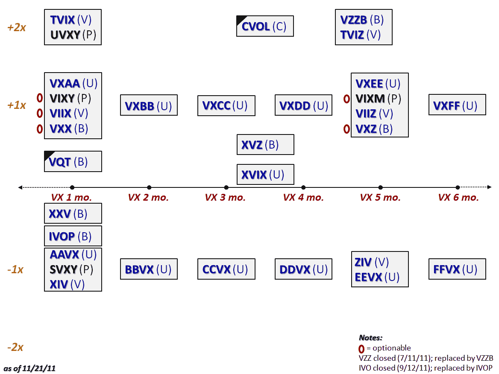

<!--yml

分类：未分类

日期：2024-05-18 16:47:30

-->

# VIX 和更多：剖析 VIX ETP 的 31 种口味

> 来源：[`vixandmore.blogspot.com/2011/11/ten-months-have-passed-since-last-time.html#0001-01-01`](http://vixandmore.blogspot.com/2011/11/ten-months-have-passed-since-last-time.html#0001-01-01)

自上次尝试图形描述所有[基于 VIX 的交易所交易产品](http://vixandmore.blogspot.com/search/label/VIX%20ETN)以来，已经过去了十个月；当时有 16 种这样的证券；现在这个数字已经膨胀到 31，并且有两家已经关闭了大门（[IVO](http://vixandmore.blogspot.com/search/label/IVO)和[VZZ](http://vixandmore.blogspot.com/search/label/IVO)）。

下图尝试将羊群映射到 x 轴的目标持续时间和 y 轴的杠杆上。除了这些重要标准外，我还进一步将群体划分为四个 ProShares ETFs（用黑色表示，其余均为 ETNs），用红色 O 标记五只可选择权的 ETP，并用黑色三角形标记两只含有非 VIX 成分（以标普 500 指数形式）的 VIX ETP。为了更加精确，我用圆括号中的一个字母缩写表示发行商（**B**arclays, **V**elocityShares, **P**roShares 和 **U**BS）。

值得注意的是，本月早些时候，标普和 VelocityShares [宣布](http://velocityshares.com/news/SP500_VIX_Futures_11-3-11.pdf)了几种新的 VIX 期货策略指数，这暗示了未来的 VIX ETP，所有这些都将包括一个多头成分和一个空头（反向）成分。

VIX ETP 领域已经足够令人兴奋，资产管理规模超过 21 亿美元，日交易量超过 4500 万股。正如 2011 年在这个领域一样激动人心，2012 年似乎会更加热闹。

相关文章：

*******

***披露(s):*** *无***
