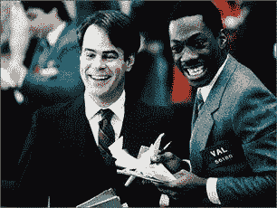

<!--yml

请注意，你可以认为第一季度 VIX 的飙升是对 2006 年第二季度飙升的非确认，因为它没有达到 2006 年的高峰。8 月更高的 VIX 高点“确认”了熊市趋势，按照这种推理（假设 VIX 实际上已经达到顶峰），当前的飙升是另一个具有牛市含义的非确认。”

date: 2024-05-18 18:52:57

-->

# VIX and More: Smart Money and the VIX

> 来源：[`vixandmore.blogspot.com/2007/11/smart-money-and-vix.html#0001-01-01`](http://vixandmore.blogspot.com/2007/11/smart-money-and-vix.html#0001-01-01)

伯尼·舒尔茨的“[周一晨间展望](http://www.schaeffersresearch.com/commentary/observations.aspx?ID=20929&obspage=1)”对于任何交易员来说，在进入交易周之前都是一个很好的视角。这周的评论是其中较好的一个，因为舒尔茨查看了各种数据点，以考虑市场是否可能正在触底。

舒尔茨提出的一个主题是，一种开始占据上风的担忧正在取代最近投资者的自满。舒尔茨在评论中以 VIX 为例，说明了他的评论中的持续自满，并因此提出了一个可能更有趣的论点，他和他的同事们认为 VIX 行动代表了聪明钱的运作：

“对于这种日益严重的自满装甲的裂缝，VIX 是一个少数派。即使市场不屈不挠地进入亏损领域，VIX 也几乎没有什么变化。事实上，这个所谓的‘恐惧指数’已经好几个星期没有显示出任何警觉的迹象，反而更喜欢横盘整理。它还没有超过 30 点的显著动作，也没有接近 8 月中旬的高点。”

“然而，VIX 的行动带来了一些非常有趣的可能性。它持续无法跌破 32 周趋势线，这对我们之前指出过来说是不利的。但是我想知道，11 月的反弹是否实际上暗示了它的上涨，而不是 8 月的反弹，这种‘非确认’的意味，而不是通常认为这是自满的熊市指标。这种解释只有在您认为 VIX 代表了聪明钱的情况下才说得通，这是一个我们今年在舒尔茨公司达成的逐渐形成的结论。” [强调添加]

暂时不考虑谨慎-自满问题，我发现有趣的是，舒尔茨认为 VIX 是聪明钱的脚印。我自己也慢慢得出同样的结论，并且将来会在这个空间里更科学地探讨这个问题。
