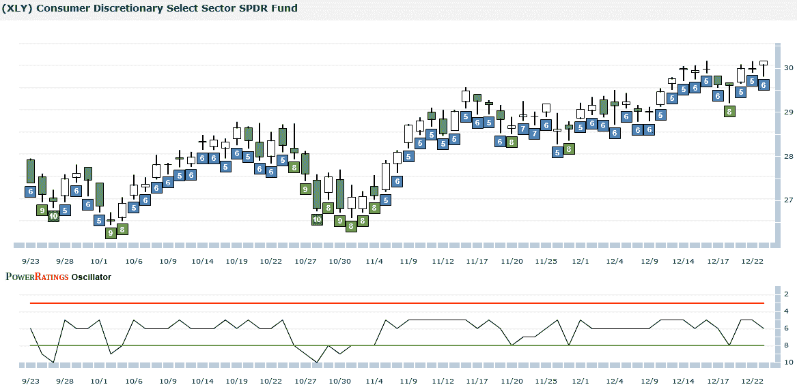

<!--yml

类别：未分类

日期：2024-05-18 17:19:14

-->

# VIX 和更多：交易 ETFs 的一些方法

> 来源：[`vixandmore.blogspot.com/2009/12/some-approaches-to-trading-etfs.html#0001-01-01`](http://vixandmore.blogspot.com/2009/12/some-approaches-to-trading-etfs.html#0001-01-01)

两天前在[ETFs 日益主导交易](http://vixandmore.blogspot.com/2009/12/etfs-increasingly-dominate-trading.html)一文中，我提到这个博客将在未来一年更多地关注[ETFs](http://vixandmore.blogspot.com/search/label/ETFs)。我已经决定，在围绕这个主题跳了三年的舞之后，我将更加明确地谈论不同的[战略方法](http://vixandmore.blogspot.com/search/label/trading%20strategies)来交易，以及具体的策略。

昨天，当我思考这两个新的焦点在哪里交汇时，我注意到了来自[CXO 咨询集团](http://www.cxoadvisory.com/)的一篇及时的文章，标题为[简单行业 ETF 动量策略表现](http://www.cxoadvisory.com/blog/internal/blog12-22-09/)。这篇文章研究了三种不同的行业[SPDR](http://vixandmore.blogspot.com/search/label/SPDRs)动量策略，最终得出结论：“简单的行业 ETF 动量策略在过去十年中通常超越了广泛的股票市场，交易摩擦相对较低。”作为一个积极交易行业轮动策略的人，我不能说我对结果感到惊讶，但我认为分析和图表非常值得一读，当然值得点击查看。

说到行业和地理 ETFs，我还最近检查了[TradingMarkets.com](http://www.tradingmarkets.com/)在他们的[ETF PowerRatings](http://pr.tradingmarkets.com/etf/)中对 ETFs 做的一些工作。任何熟悉 Larry Connors 工作的人都会看到一些之前出版物中的类似主题是如何被适应到 ETF 世界的。根据一些入门材料和对以下[XLY](http://vixandmore.blogspot.com/search/label/XLY)图表的审查，看来评分给予表现出中期趋势强度，然后是最近回调的 ETF 最高评分。换句话说，评分使得在回调后容易建立长期上升趋势或短期下跌趋势的高概率入场信号。坦白说，这就是我之前取得很多成功的战略方法，看来 ETF PowerRatings 实施与我对 ETFs 的一些思考相似。

如果 TradingMarkets 的方法对那些希望别人做所有分析和产生买卖信号的投资者有吸引力，那么[ETF Rewind](http://etfrewind.blogspot.com/)就处于另一个极端。在 ETF Rewind Pro 中，Jeff Pietsch 建立了一个基于 Excel 的数据和分析平台，非常适合那些喜欢自己做分析并制定自己策略的投资者，但需要一个平台来实现这一切。今年早些时候，在[使用 ROB 进行对冲交易](http://vixandmore.blogspot.com/2009/08/pairs-trading-with-rob.html)一文中，我谈到了 ETF Rewind 可以用于的一些对冲交易应用。我忘记提到 ETF Rewind 还包含生成长短周趋势交易想法、日常逆趋势交易想法和日交易候选人的模块。当然，大多数投资者还希望利用近似 200 只 ETF 的百科全书式的数据，并使用数据和工具来制定自己的策略。

我还应该提到，我有一个订阅服务，我很少在这里讨论，它利用了我称之为 EVALS（ETF 波动性分析长短）的波动性 ETF 交易方法。EVALS 的特点是它是一种交易方法，它利用基于波动性的指标来触发买卖信号。想了解更多信息，可以尝试访问[VIX 和更多 EVALS](http://vixandmoreevals.blogspot.com/2008/08/vix-and-more-evals-etf-volatility_19.html)或者查看[EVALS 博客](http://vixandmoreevals.blogspot.com/)。

关于相关主题的更多信息，读者们被鼓励去查看：

**[图片：ETF PowerRatings 和 TradingMarkets.com]**

***披露：*** *[ETF Rewind](http://etfrewind.blogspot.com/)和[VIX 和更多订阅者新闻简报](http://vixandmoresubscriber.blogspot.com/)作为捆绑包的一部分提供（与[Quantifiable Edges](http://quantifiableedges.blogspot.com/)一起），该捆绑包在[博客三合一](http://vixandmoresubscriber.blogspot.com/2009/03/announcing-blogger-triple-play.html)中提供。*
