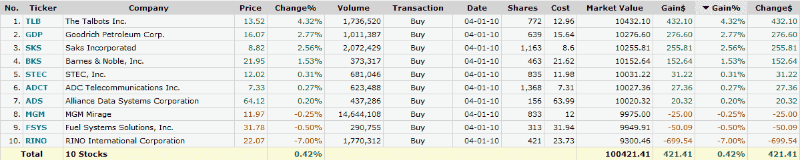

<!--yml

分类：未分类

日期：2024-05-18 17:12:17

-->

# VIX 和更多内容：一些市盈率高的股票

> 来源：[`vixandmore.blogspot.com/2010/04/some-more-high-short-interest-stocks.html#0001-01-01`](http://vixandmore.blogspot.com/2010/04/some-more-high-short-interest-stocks.html#0001-01-01)

昨天，[短期挤压组合一年后](http://vixandmore.blogspot.com/2010/03/short-squeeze-portfolio-one-year-later.html)突出了七只股票和两只 ETF，它们在 2009 年 3 月初的[市盈率](http://vixandmore.blogspot.com/search/label/short%20interest)极高。毫不奇怪，随着市场和经济的好转，这些股票表现非常好。

在图表中有了大约 13 个月的牛市之后，使用当前数据构建的类似投资组合是牛市的购物清单还是熊市的购物清单？

看着下面列出的名单（包括 30%的流通股被 short 的公司，平均每日交易量至少为一百万股，以及额外的筛选条件，如可交易性、最低市值、价格等），我在昨天下班后整理了这个名单，最近表现良好的股票（[TLB](http://vixandmore.blogspot.com/search/label/TLB), [SKS](http://vixandmore.blogspot.com/search/label/SKS)）在其中占有很大比例，还有一些近期表现不佳的股票([GDP](http://vixandmore.blogspot.com/search/label/GDP), [STEC](http://vixandmore.blogspot.com/search/label/STEC), [FSYS](http://vixandmore.blogspot.com/search/label/FSYS))。由于我更倾向于做空弱势股而不是强势股，我将密切关注后者作为可能的做空目标，同时关注塔博茨和萨克斯等零售商的可能的买入机会，直到有更好的证据表明消费者——以及零售股票——正在经历疲劳。

关于相关主题的更多信息，读者可以查阅：

*[source: FINVIZ.com]*

***披露：*** *无*
