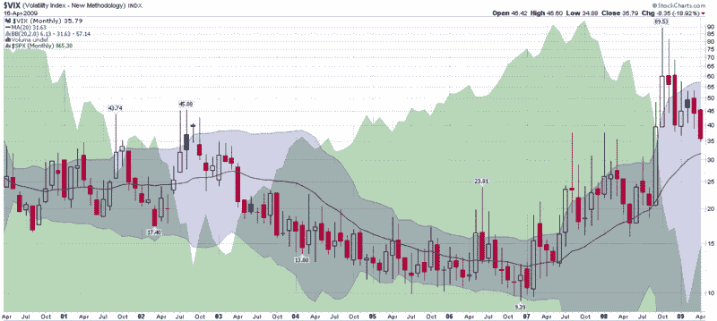

<!--yml

分类：未分类

日期：2024-05-18 17:51:37

-->

# VIX and More: Some VIX Milestones…and a Prediction

> 来源：[`vixandmore.blogspot.com/2009/04/some-vix-milestonesand-prediction.html#0001-01-01`](http://vixandmore.blogspot.com/2009/04/some-vix-milestonesand-prediction.html#0001-01-01)

不管你怎么看，这都是一个有趣的交易日。当一切都说完做完了，SPX 的收盘价达到了 2 月 9 日以来的最高值，并且距离其[200 天简单移动平均线](http://vixandmore.blogspot.com/search/label/200%20day%20SMA)（SMA）最近，这是自去年 9 月 26 日以来的最接近。

今天 VIX 触及了一些有趣的里程碑。今天的收盘价为 35.79，是自去年 9 月 26 日以来的最低收盘价，VIX 的 10 日 SMA（截至昨天）首次跌破 40。在其他 VIX 家族成员中，iPath S&P 500 VIX Short-Term Futures ETN（VXX）目前已跌至 1 月 30 日推出以来的最低点（94.91）。最后，标普 500 的 10 日历史波动率降至 10 周低点（31.18），20 日 HV 首次在过去 6 周跌破 40。

虽然上述数字代表波动性的 incremental change，但它们也反映了投资者心态的巨大转变。就在几周前，人们普遍认为所有银行都资不抵债，经济要到 2010 年才能复苏，如果我们幸运的话，房地产市场可能会在今年年底前触底。

这里一闪希望，那里一闪希望，现在突然之间一些最坏的情况被抛弃了。或许这只是经济恶化步伐放缓的一个例子，但总有这样的可能性，事情已经开始好转。在六个月的时间里，坏消息越来越糟，越来越糟的消息变成了可怕的消息，甚至能够把几个可能的灾难性情景排除在外，似乎都成了庆祝的理由。但是，庆祝是否为时过早？

波动性之所以难以预测，是因为最近波动性的下降不会低于 30-32 的水平，然后可能会在(月度)图表下方的 20 个月 SMA 处 flatten out。

如果你还没有研究过或交易过 VXX，下周可能是考虑用这个[VIX ETN](http://vixandmore.blogspot.com/search/label/VIX%20ETN)进行对冲或投机的好时机，以期待波动率的上行。

来源：[StockCharts]*
