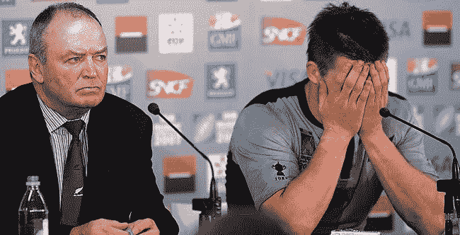

<!--yml

category: 未分类

date: 2024-05-18 18:30:15

-->

# VIX and More: Sports, Emotions and Trading

> 来源：[`vixandmore.blogspot.com/2008/08/sports-emotions-and-trading.html#0001-01-01`](http://vixandmore.blogspot.com/2008/08/sports-emotions-and-trading.html#0001-01-01)

每天早上醒来，我会喝一口来自博客世界的新闻火水，以了解世界上正在发生的事情，了解一些学者们对这些和其他发展的看法。我发现这个过程在短时间内给我带来了很多随机的想法，经常导致一些有趣的并置，这有助于激发我自己的思考。

今天早晨刚好有一个这样的并置。首先，在 [Olympics and Stocks Don’t Mix](http://www.marketwatch.com/news/story/story.aspx?guid=%7B0211F077%2D2375%2D4ACA%2DBEFB%2DE4DCF7A00DD8%7D&siteid=rss#comments) 中，马克·赫尔伯特引用了埃德曼斯、加西亚和诺尔里（“[Sports Sentiment and Stock Returns](http://www.afajof.org/afa/forthcoming/3096.pdf)”）的研究，显示世界杯足球比赛的失利会导致当地股市在第二天表现明显下滑。

Hulbert 将这项研究融入了他自己的观察：

*“根据我的经验，很少有投资者意识到情绪在他们决策中的作用。当受到质疑时，他们能够指出一长串理由，都有很好的文献记录，解释他们的策略是基于坚实的统计基础。但是，大多数情况下，我仍然不相信他们。”*

*这是因为有不同类型的原因。一方面，有真正解释我们为什么决定做某事的原因。另一方面，在决定做出后，我们会寻找一些理由，来为自己和他人辩解。我听到或读到的大多数投资理由属于后一种类型。“*

紧接着马克·赫尔伯特（Mark Hulbert），我发现了布雷特·斯汀巴格（Brett Steenbarger）的 [A Dozen Thoughts on Trading Stress and Emotion](http://traderfeed.blogspot.com/2008/08/dozen-thoughts-on-trading-stress-and.html)。老实说，我不记得曾经看过如此之多内容的简短清单，对于交易者来说，它在“[了解自己](http://en.wikipedia.org/wiki/Know_thyself)”领域有很多值得思考的内容。

看待市场以及你与市场的互动方式有很多种，但是永远不要低估这个方程式两侧的情绪因素。
