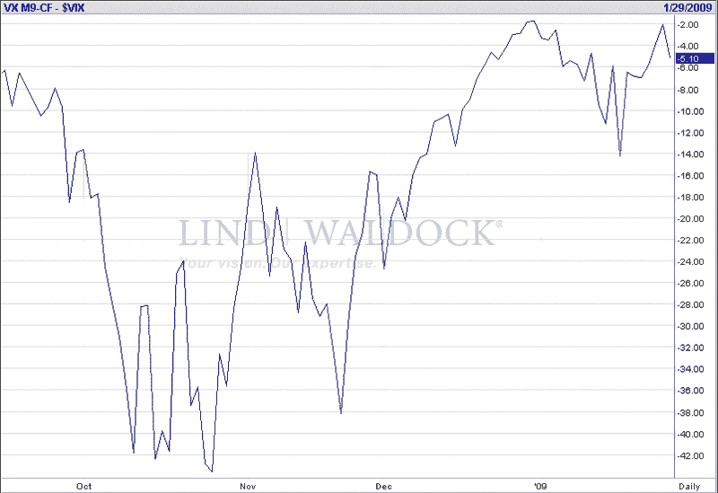

<!--yml

分类：未分类

日期：2024-05-18 18:03:09

-->

# VIX and More: Spot VIX vs. VIX Five Month Futures

> 来源：[`vixandmore.blogspot.com/2009/01/spot-vix-vs-vix-five-month-futures.html#0001-01-01`](http://vixandmore.blogspot.com/2009/01/spot-vix-vs-vix-five-month-futures.html#0001-01-01)

周二我通过类比的方式撰写了[Thinking About the New VIX ETNs](http://vixandmore.blogspot.com/2009/01/thinking-about-new-vix-etns.html)。今天我想尝试直接的方式，展示现金/现货 VIX 和[VIX 期货](http://vixandmore.blogspot.com/search/label/VIX%20futures)五个月后的差异的图表。

请记住，明天开始交易的 Barclays [VIX ETNs](http://vixandmore.blogspot.com/search/label/VIX%20ETN)，其目标是对一个月([VXX](http://vixandmore.blogspot.com/search/label/VXX))和五个月([VXY](http://vixandmore.blogspot.com/search/label/VXY))的期货进行恒定加权平均到期。实现这种恒定到期涉及每天混合不同比例的各种期货到期。下面的图表略有不同，它使用到期为五个月的 VIX 期货，但每个月只滚动一次合约。尽管如此，它非常好的近似了现金/现货 VIX 和五个月到期的 VIX 期货之间的差异。除了确认当前波动性预期与五个月后的预期之间存在较大差异外，VIX 与 VIX 五个月期货之间的差异峰值和谷值在与同一时期标普 500 指数的峰值和谷值之间显示出高度相关性。

无论如何，随着 VIX ETNs 接近起跑线，这是值得思考的。

是的，这些原则与我谈论的[VIX:VXV](http://vixandmore.blogspot.com/search/label/VIX%3AVXV)比率相似。记录在案，在我打下这些字的时候，VIX:VXV 比率是 0.976，略微偏向空头，但与这个比率在过去一个月内保持的紧密区间一致。

来源：[FutureSource.com]*

对于新 VIX ETNs 的一些额外视角，请查看：

对于那些可能错过的人，我周末在[Barclays VIX ETNs Slated to Begin Trading on Friday](http://vixandmore.blogspot.com/2009/01/barclays-vix-etns-slated-to-begin.html)中发布了一些关于 VIX ETNs 的初步想法，来自顶级博主。*
