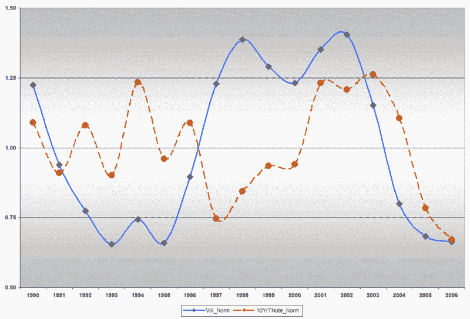

<!--yml

分类：未分类

日期：2024-05-18 15:58:43

-->

# VIX 和更多：股票还是债券的波动性？

> 来源：[`vixandmore.blogspot.com/2007/02/stock-or-bond-volatility.html#0001-01-01`](http://vixandmore.blogspot.com/2007/02/stock-or-bond-volatility.html#0001-01-01)

迈克在[HEDGEFolios.com](http://hedgefolios.com/)是众多在寻找更好指标的人之一，他们[想知道](http://hedgefolios.com/read/treasury-vix)VIX 是否已经过了它的使用期，因为最近一系列个位数的读数使许多人重新寻找更好的指标。他的建议是：为什么不看看 10 年国债的波动性，而不是股票的波动性呢？

我从不让任何未经测试的想法远离电子表格，我检查了 1990-2006 年 10 年国债的波动性，并发现 2006 年是记录上最平静的一年，而 2007 年开始变得更加平静。VIX 与 10 年国债的 17 年相关性为 0.24，但在过去十年中上升到 0.43，在过去的三年中更是达到令人印象深刻的 0.99，如下面的图表（带有标准化值）所示。

(http://i104.photobucket.com/albums/m163/bl82/NormalizedVIXvs10YrTNote.gif)

10 年国债当前的波动性离 1998 年夏季的历史低点还有相当长的距离，但随着 VIX 的不断走低，始终关注长期债券是一个好主意。
