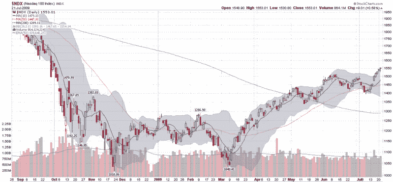

<!--yml

分类：未分类

日期：2024-05-18 17:37:36

-->

# VIX and More: StockCharts.com Charts on the Blog

> 来源：[`vixandmore.blogspot.com/2009/07/stockchartscom-charts-on-blog.html#0001-01-01`](http://vixandmore.blogspot.com/2009/07/stockchartscom-charts-on-blog.html#0001-01-01)

到目前为止，我在网上最喜欢的股票图表网站是[StockCharts.com](http://stockcharts.com/)，从中导入了不少截图到博客中。

最近我回答了一些关于我的 StockCharts 图表的问题，我想花点时间谈论这些图表中包含的信息。首先，StockCharts 提供所谓的“[图库视图](http://stockcharts.com/charts/GalleryView/)”给每个股票。这是一组包含三个月日线数据、两年周线数据和一个点数图的三张免费图表。StockCharts 会员还有一个第四张图表，使用过去四天的十分钟内线。

虽然这些图库图表是一个很好的起点，但 StockCharts 的真正力量在于创建自定义图表。本文底部是我所谓的来自 StockCharts 的“标准图表”，它使用了过去十一个月的日线。我的标准图表使用蜡烛图，因为我喜欢在一个蜡烛中能显示的信息内容。我还使用了三条简单移动平均线：10 天（实线蓝色）用于短期；50 天（虚线红色）用于中期；以及[200 天](http://vixandmore.blogspot.com/search/label/200%20day%20SMA)（虚线绿色）用于长期。这些是广泛使用的移动平均线，选择 somewhat arbitrary. 我喜欢 10 天而不是更常见的 20 天，因为我通常有非常短期的投资时间范围，而且跟随 VIX 的交易者也会大量使用 10 天。

蜡烛图周围的灰色云区是[布林带](http://vixandmore.blogspot.com/search/label/Bollinger%20bands)，设置为 20 天和两个标准差。我喜欢使用布林带来感知历史波动率（[historical volatility](http://vixandmore.blogspot.com/search/label/historical%20volatility)）在价格数据之上的涨跌，而不是作为主要价格图表上方或下方的独立研究。我选择以区域形式而不是更典型的线条形式显示这些数据，因为我想限制图表中杂乱的线条，并给予一些视觉上的清晰度。根据 John Bollinger 进行的大量研究，假设未来与过去相似，那么未来所有日价格变动的 88-89%应落在当前布林带定义的范围内。

图表上唯一的其他图形数据是成交量数据，其中包括一条 50 天的指数移动平均线（紫色），使得识别大量成交量激增相对容易。

最后，最近有读者询问为什么 y 轴不是比例的。简单答案是，图表可以绘制标准（比例）y 轴或对数轴。标准轴的优点是测量绝对变化很容易：上升十点和下降十点高度相同。然而，对于更长的时期，复合增长会扭曲百分比变化，因此对数轴确保百分比上升和下降的高度相同。考虑一只$100 的股票。如果它连续三年上涨 50%，最终会达到 337.50 美元（100*1.5*1.5*1.5），变化了 227.50 点。但如果同一只股票连续三年下跌 50%，它将降至 12.50 美元，仅变化了 87.50 点。在标准 y 轴上，三年上涨 50%的走势将看起来是三年下跌 50%的 2.6 倍（237.50 / 87.50）。对数轴确保这些百分比变化在视觉上看起来相同。在未来的文章中，我将更多地讨论对数轴，并使用一些示例来说明它们的优缺点。

同时，对于那些想要了解更多关于图表、高质量图表以及将想法以图表形式归档的人来说，建议去 StockCharts.com 试试。如果你想看看其他人使用现有工具做了些什么，去看看[公共图表](http://stockcharts.com/def/servlet/Favorites.CServlet?obj=public&cmd=show&disp=RED)部分。

*[来源：StockCharts]*
