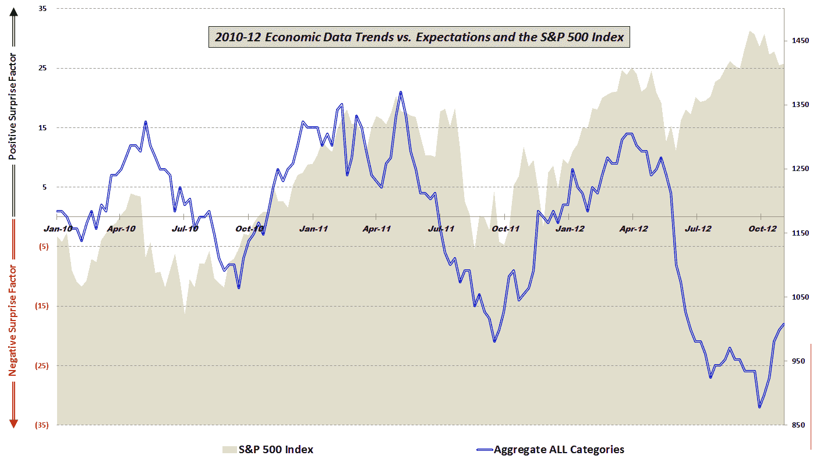

评论：

类别：未分类

日期：2024-05-18 16:23:59

-->

# VIX and More: Stocks and Economic Data Continue to Move in Opposite Directions

> 来源：[`vixandmore.blogspot.com/2012/11/stocks-and-economic-data-continue-to.html#0001-01-01`](http://vixandmore.blogspot.com/2012/11/stocks-and-economic-data-continue-to.html#0001-01-01)

四个月前，在[经济数据之崖](http://vixandmore.blogspot.com/2012/07/economic-data-cliff.html)一文中，我讨论了相对于预期的经济数据的快速恶化，并注意到了经济数据与股市之间突然强烈的分化。

当时我提出了两种可能的解释：

> 或许股市与现实脱节，仅仅是在推迟不可避免的下跌，但也存在这样的可能性，股市价格开始反映出年底或 2013 年初经济复苏的可能性。

有了四个月的的后视镜优势，经济数据与股市之间的关系仍然不明朗。在过去的 2 ½ 年里一直紧密相关之后，股市和经济数据自六月初开始几乎完全相反地移动，这无疑部分是由于全球中央银行的干预。

然而，我认为下图特别有趣的是，就在经济数据相对于预期的趋势在六月份开始与股市分化时，大约一个月前经济数据开始显示出改善迹象，这两个指标又开始趋同。

当然，对于那些今天看到令人鼓舞的[非农就业报告](http://vixandmore.blogspot.com/search/label/nonfarm%20payrolls)而选择在今天早上买入股票的投资者来说，这一切都不会感到惊讶。至少到目前为止，股市和经济数据继续相反方向移动——无论这对股市意味着上涨还是下跌。

对于对本图中所包含的组件数据以及所使用的方法感兴趣的读者，建议查看下方的链接。对于那些想要了解构成我汇总数据计算的一部分的具体经济数据发布信息的人，请查看*[本周图表：经济数据之年 (2010)](http://vixandmore.blogspot.com/2011/01/chart-of-week-year-in-economic-data.html)*。

相关文章：

来源：各种

***披露(s):*** *无*
