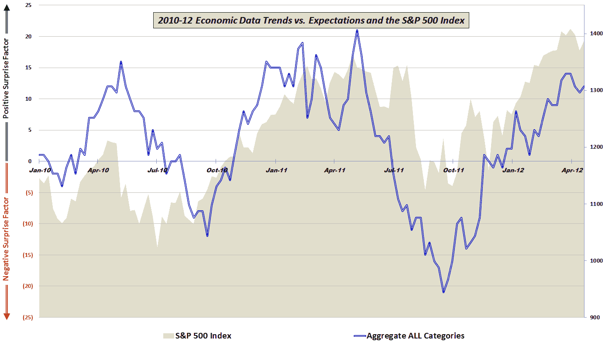
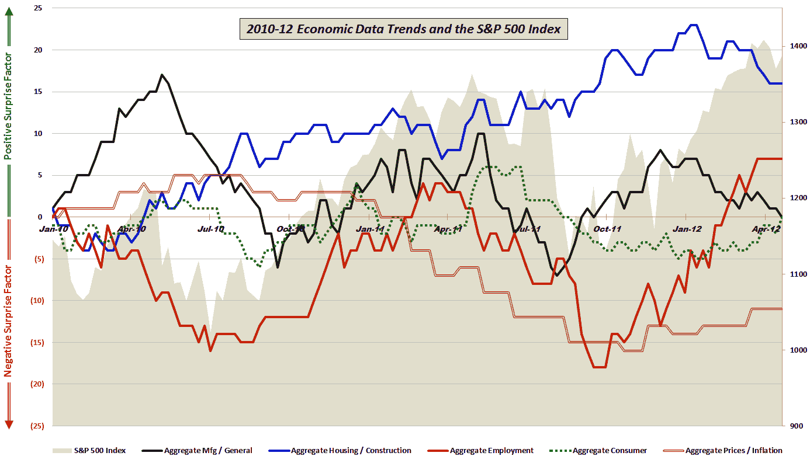

<!--yml

类别：未分类

日期：2024-05-18 16:32:30

-->

# 波动率指数与更多：尽管制造业和房地产市场数据令人失望，股市和经济数据仍在上升。

> 来源：[`vixandmore.blogspot.com/2012/04/stocks-and-economic-data-on-upswing.html#0001-01-01`](http://vixandmore.blogspot.com/2012/04/stocks-and-economic-data-on-upswing.html#0001-01-01)

在许多方面，今天反映了 2012 年前 4 ½个月的缩影：[工业生产](http://vixandmore.blogspot.com/search/label/industrial%20production)和[房地产市场](http://vixandmore.blogspot.com/search/label/housing)的启动数据未达到预期，但股市仍升至高点。

这是我在经济数据与预期对比方面发布的第三年 proprietary data，我在不同的格式下展示这些数据，或者分为五个经济活动组（制造业/宏观经济、房地产/建筑、就业、消费者和价格/通胀。）这次，我选择了两者都做，汇总数据在上面的图表中，详细的细分在下面的图表中。

综合故事在 30,000 英尺的高度描绘了画面：自去年 9 月底以来，经济数据一直超出预期，股市也随着超出预期的消息而上涨。细节图表讲述了一个更加细微的故事。在这里，我们可以看到 2011 年第四季度几乎在所有领域都出现了积极惊喜，然而 2012 年却出现了大量令人失望的数据，涉及房地产/建筑以及制造业/宏观经济数据。

在 2010 年和 2011 年，正是制造业和宏观经济数据的积极惊喜结束时，股市出现了看跌的下跌。到目前为止，2012 年，制造业和宏观经济数据的失望并没有对股市反弹造成太大影响。我的感觉是，这些数据和股市将在下个月内同向变动。这意味着数据上升还是股市下跌还有待观察。

**[对于那些对包含在此图表中的分项数据以及所使用的方法感兴趣的读者，建议查看下面的链接。对于那些寻求关于构成我汇总数据计算部分的具体经济数据发布细节的人，请查看*[图表一周：2010 年的经济数据](http://vixandmore.blogspot.com/2011/01/chart-of-week-year-in-economic-data.html)*。]**

相关文章：

****

****

**披露（s）：** *无*

**[来源：多种]**
