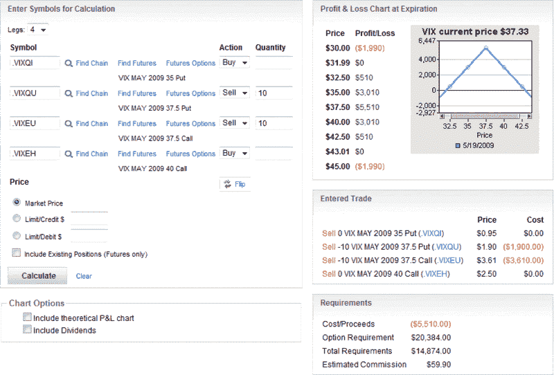
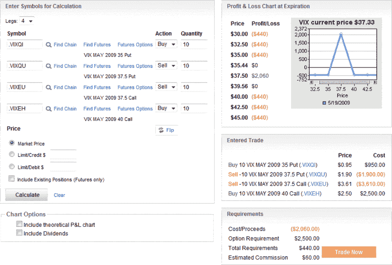

<!--yml

类别：未分类

日期：2024-05-18 17:51:47

-->

# VIX 和更多：Straddles 与 Iron Butterflies

> 来源：[`vixandmore.blogspot.com/2009/04/straddles-vs-iron-butterflies.html#0001-01-01`](http://vixandmore.blogspot.com/2009/04/straddles-vs-iron-butterflies.html#0001-01-01)

在收到关于昨天[VIX 到期 straddle](http://vixandmore.blogspot.com/2009/04/vix-expiration-straddles.html)和一篇相关的前置文章[VIX 蝴蝶策略](http://vixandmore.blogspot.com/2009/02/vix-butterfly-play.html)的问题和评论后，我意识到我避开了一个应该更加重视的基本期权问题：无限风险与有限风险。

这个问题围绕交易期权中的一个关键概念：头寸的最大损失是否有限？换句话说，在头寸开盘时，是否可以用美元来定义最大损失以及发生这种损失的价格点？

这个问题也可以用图形形式来解答。

在下面由 optionsXpress 提供的利润和损失图表中，我复制了一个与[straddle](http://vixandmore.blogspot.com/search/label/straddle)交易类似的交易，不同之处在于它使用了五月期权。

如果交易有无限风险，如下面的 short straddle 所示，利润和损失图表将在 x 轴的左端和右端显示斜线。

相比之下，通过购买保险来保护免受无限损失，从而增加一个 short straddle 头寸是可能的（在某些圈子里被称为“购买翅膀”）。结果是一个铁[蝴蝶](http://vixandmore.blogspot.com/search/label/butterfly)，其“翅膀”限制了损失。

下面的图表显示了与上面 short straddle 相同的交易，但增加了 out of the money 看跌和看涨期权的购买。注意新翅膀是反映在这个头寸中 440 美元损失限制的水平线。

在极端波动的情况下，翅膀特别重要。在 short straddle 中，VIX 每超过 45 美元 1 美元，就会产生额外的 1000 美元损失。然而，铁蝴蝶在 40 美元处限制了损失，所以 VIX 可以在 40 美元以上任意波动，不会影响底线。VIX 急剧下跌时，也是同样的动态。

请注意，保险的成本将最大潜在利润（从 5510 美元降至 2060 美元）降低 63%，并且也将交易的盈利价格范围（从 31.99-43.01 美元缩小至 35.44-39.56 美元）降低同样的 63%。

将购买翅膀的成本视为限制风险的保险价格可能会有所帮助。大多数交易员更愿意支付保险费，以便晚上睡个好觉，但也有少数人选择放弃翅膀，希望避免灾难。这种方法在短期内可能有效，但从长远来看，这是失去所有交易资本的绝佳方式。

记录在案，前面提到的关于日历价差和蝴蝶价差的关系类似于[宽跨式](http://vixandmore.blogspot.com/search/label/strangle)和[秃鹰价差](http://vixandmore.blogspot.com/search/label/condor)之间的关系。

