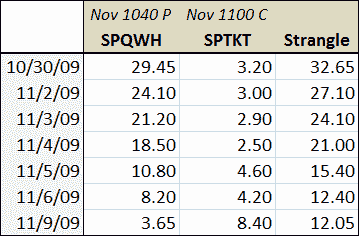

<!--yml

分类：未分类

日期：2024-05-18 17:22:55

-->

# VIX and More: Strangle Pong Update

> 来源：[`vixandmore.blogspot.com/2009/11/strangle-pong-update.html#0001-01-01`](http://vixandmore.blogspot.com/2009/11/strangle-pong-update.html#0001-01-01)

在 10 月 30 日的[Strangle Pong](http://vixandmore.blogspot.com/2009/10/strangle-pong.html)文章中，我讨论了可能会分阶段进入 S&P 500 指数宽跨式期权，首先出售一个 11 月 SPX 1040 看跌期权，并在指数反弹回到 1080 上方时出售一个 11 月 SPX 1100 看涨期权。

六天交易后，我们在这里，当时我在原始文章中提到的 SPX 11 月 1040 看跌期权，从大约 24.00 跌回到我打这些字时的不到 4.00。

 右侧的表格显示了自从我提到宽跨式期权以来，1040 看跌期权（SPQWH）和 1100 看涨期权（SPTKT）的收盘价值（今天的价值是截至东部时间下午 1:00 的买卖价的中点）。表格显示，SPX（从 1043 到 1086）的反弹和 VIX（从约 28 到 23）的大幅下跌，都显著侵蚀了 1040 看跌期权的价值。有趣的是，看涨期权的价值的增加不如看跌期权的波动那么戏剧性，因为时间衰减（time decay）已经抵消了由于标的资产上涨而实现的一些收益。

坦白说，这将是一个非常好的时机来平掉空头看跌期权头寸并赚取一笔可观的利润。然而，如果坚持最初的思路，交易员可以让空头看跌期权继续持仓，并做空 1100 看涨期权来打开宽跨式期权的另一腿。与空头看跌期权相比，风险回报率不那么有吸引力，但假设（也许这是最重要的假设）1100 继续充当上阻力，那么对于看涨期权收取 8.40 美元是一个有吸引力的机会。

注意，这个宽跨式期权（strangle）没有任何形式的对冲。正如之前提到的，可以通过“购买翅膀”（在 SPX 1040 下方 offsetting long put positions 和在 1100 上方 offsetting long call positions）来限制风险，并将这个头寸转换为铁鹰（iron [condor](http://vixandmore.blogspot.com/search/label/condor)）。

-   相关文章，读者们被鼓励去查看：

