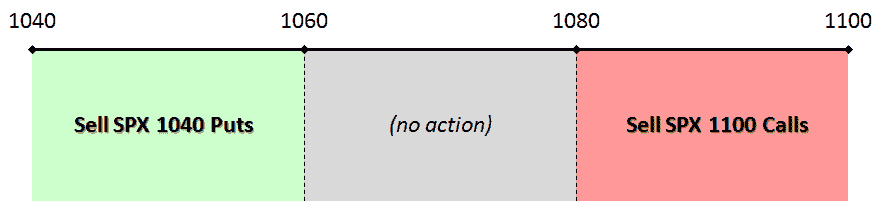

<!--yml

类别：未分类

日期：2024-05-18 17:24:14

→

# VIX and More: Strangle Pong

> 来源：[`vixandmore.blogspot.com/2009/10/strangle-pong.html#0001-01-01`](http://vixandmore.blogspot.com/2009/10/strangle-pong.html#0001-01-01)

至少在目前，看起来标普 500 指数在 1100 遇到了强阻力，在 1040 以上一点遇到了强支撑。假设这些支撑和阻力水平可以再维持三周——这显然是一个很大的假设——那么当前市场环境非常适合我所说的“strangle pong”与 11 月 SPX 期权相结合的交易方法。本质上，这是一种假设区间交易的策略，当标的资产接近交易区间的某一端时，卖出接近价钱的期权。

The graphic below outlines one way to approach this type of trade. Specifically, it involves dividing the trading range into three zones (which do not have to be of equal size, they just happen to be in the diagram): an upper end of the trading range in which one sells calls; a lower end of the trading range in which one sells puts; and a neutral zone near the middle of the range in which one takes no action (or perhaps sells both puts and calls.)

In an ideal world, the underlying bounces back and forth between support and resistance just like the [pioneering computer game](http://en.wikipedia.org/wiki/Pong) and the options seller captures a high premium each time the underlying approaches the end of the range. Once both puts and calls have been sold, a [strangle](http://vixandmore.blogspot.com/search/label/strangle) is established, with the maximum profit and loss zone being defined by the target trading range.

成功的关键因素之一是标的资产在交易期限内的波动范围。其次重要的是标的资产的波动性，其中波动性的增加会提高卖出的期权价格，对期权卖方不利。这是头寸的[vega](http://vixandmore.blogspot.com/search/label/vega)值，我将在未来的文章中讨论这个问题。

管理头寸风险有多种方法，其中最有效的方法之一是“购买翅膀”（在 SPX 1040 以下买入看跌期权，在 1100 以上买入看涨期权，以此抵消头寸）并将此头寸转换为铁[condor](http://vixandmore.blogspot.com/search/label/condor)。根据 strangle pong 方法，现在 SPX 交易略低于 1050，正是通过卖空一些 SPX 1040 看跌期权来启动这一交易的第一步的好时机。让我们看看市场在未来一周左右会有何变动；那时我将重新审视 strangle pong 交易方法。

For additional posts on strangles, readers are encouraged to check out:

