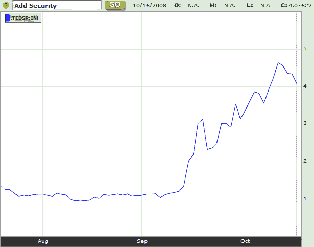

<!--yml

分类：未分类

日期：2024-05-18 18:20:28

-->

# VIX and More: TED Spread and VIX Both Coming Back to Earth?

> 来源：[`vixandmore.blogspot.com/2008/10/ted-spread-and-vix-both-coming-back-to.html#0001-01-01`](http://vixandmore.blogspot.com/2008/10/ted-spread-and-vix-both-coming-back-to.html#0001-01-01)

尚待观察[昨日 VIX 的新高 81.17](http://vixandmore.blogspot.com/2008/10/80s-bad-music-bad-stocks.html)，是否成为该指数的顶点。个人认为，81.17 有可能维持多年，但我也相信，[TED spread](http://vixandmore.blogspot.com/search/label/TED%20spread)（衡量[LIBOR](http://vixandmore.blogspot.com/search/label/LIBOR)利率和[3 个月美国国库券](http://vixandmore.blogspot.com/search/label/3%20Month%20Treasury%20Bill)收益率之间差异的指标）上周五的高点更可能标志着信贷市场[动脉硬化](http://en.wikipedia.org/wiki/Atherosclerosis)的最高点。

在下面的图表中，由彭博提供，您可以看到 TED spread 已经从 10 月 10 日的高点回撤了约 14%。

即使信贷市场和股票波动率出现缓慢回暖，也应该是全球经济转好的迹象。在恐惧和恐慌中有机会；当我们转变方向时，机会最大。

[来源：彭博社]
