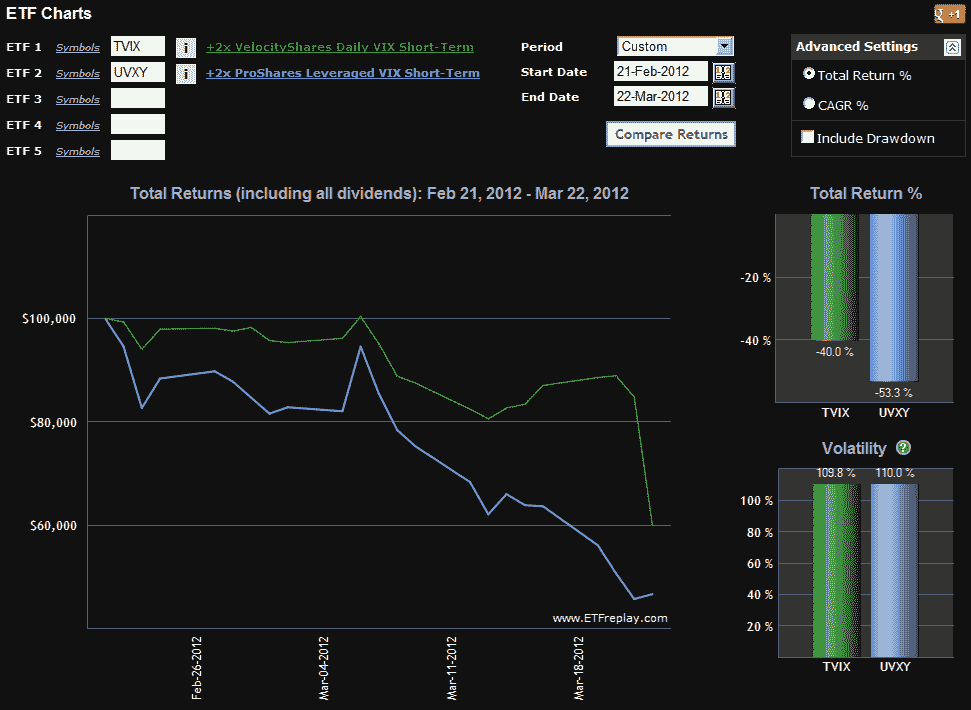

<!--yml

类别：未分类

日期：2024-05-18 16:35:18

-->

# VIX 和更多：TVIX 创设单位回归；这对投资者意味着什么

> 来源：[`vixandmore.blogspot.com/2012/03/tvix-creation-units-return-what-it.html#0001-01-01`](http://vixandmore.blogspot.com/2012/03/tvix-creation-units-return-what-it.html#0001-01-01)

一个月零一天后，瑞士信贷银行（[CS](http://vixandmore.blogspot.com/search/label/CS)）[宣布](http://vixandmore.blogspot.com/2012/02/credit-suisse-suspends-creation-units.html)暂停发行 VelocityShares Daily 2x VIX Short-Term ETN（[TVIX](http://vixandmore.blogspot.com/search/label/TVIX)）的新创设单位，发行方[宣布](http://velocityshares.com/news/TVIX_Reopen_Press_Release_22MAR12.pdf)从明天起计划“有限地”重新开放 TVIX 的发行。

在一个转折中，新闻稿还提到：

> “从 2012 年 3 月 23 日开始，瑞士信贷银行可能不时将其 ETNs 发行到其关联公司的库存中，以使 ETNs 以临时暂停发行前的大致利率可供出借。另外，从 2012 年 3 月 28 日起，瑞士信贷银行可能不时发行额外 ETNs，仅供授权市场制造商购买。*瑞士信贷银行可能以其同意出售给瑞士信贷银行符合其套保策略的特定套保工具作为接受市场制造商购买 ETNs 的条件，包括但不限于掉期。* 任何此类套保工具都将基于当时 ETNs 的暗示价值执行，不会反映 ETNs 交易价格相对于其暗示价值的溢价或折价，并且将*符合瑞士信贷银行可接受的条款，包括交易对手满足瑞士信贷银行的信用状况要求、保证金要求、最低规模和期限要求*以及其他瑞士信贷银行认为适当的条款。”[强调添加]

提到与瑞士信贷银行的套保策略一致的套保工具、掉期、交易对手信用状况、保证金要求等，可能会揭示瑞士信贷银行在上个月关闭创设单位窗口时遇到的一些问题。

今天的价格行动已经引起了一些人的注意，TVIX 在正常交易时段下跌了 29.3%，盘后交易又下跌了 11.8%，而一个几乎等值的证券，ProShares Ultra VIX Short-Term Futures ETF，[UVXY](http://vixandmore.blogspot.com/search/label/UVXY)，在标准交易时段上涨了 2.1%，盘后交易基本持平。据我所能确定，关于创建单位窗口重新开放的新闻在大约 7:34 p.m. ET 时传出，此时 TVIX 已经从周三的收盘价下跌了超过 33%。考虑到今天成交的 3000 万股大约和前一周成交的股票一样多，可以合理地得出结论，至少有一方相信新的创建单位即将推出，并希望通过在 TVIX 宣布前做空来获利。实际上，TVIX 的价格行动与 UVXY 和其他 VIX ETP 如此脱节，以至于我收到了数十个相关问题，并得出结论（[Twitter](https://twitter.com/#!/VIXandMore)，[博客评论](http://vixandmore.blogspot.com/2012/03/imos-saga-cramer-and-options.html#disqus_thread)），“TVIX 的持续下跌让我怀疑是否有人在猜测瑞士信贷是否会重新开放创建单位窗口。”

当然，投资者们对接下来会发生什么比对已经漂过去的残骸更感兴趣。

至于明天的开盘，首先记住 TVIX 今天盘后交易结束时收于 9.00，而暗示价值仍然低得多，为 7.83。虽然瑞士信贷无疑希望 TVIX 能尽快回到暗示价值水平交易，但“有限制地”这一表述可能会让一些投资者犹豫。此外，不能保证瑞士信贷在未来某个时点不会再次感到有必要暂停创建单位。因此，我一点也不惊讶明天 TVIX 在某些时候会继续以 5-10%左右的溢价交易，下周可能会降至大约 2-5%。这些数字目前还只是纯粹的猜测。大部分溢价的故事将取决于新创建的单位有多么有限，以及瑞士信贷如何积极地推动市场价格降至暗示价值。无论事情如何发展，投资者应该预计，TVIX 和 UVXY 之间在过去一个月出现的至少 90%的分歧（见下面的图表）明天将会消失。

顺便说一下，在过去一个月里对 TVIX 变得谨慎的投资者已经接受了 UVXY，以至于 UVXY 的日交易额在过去一周已经超过了 TVIX。截至周一，UVXY 还得到了期权的支撑，四月到 35 美元的期权已经看到了一定的交易活动。随着 UVXY 期权（以及-1 倍 VIX 期货 ETF [SVXY](http://vixandmore.blogspot.com/search/label/SVXY)）的出现，那些希望对基于 VIX 的 ETP 进行投机或对冲的投资者开辟了一个新的交易机会宇宙。最令人鼓舞的是，投资者现在可以利用期权轻松地以定义（有限）风险的仓位交易 VIX 产品。关于这一点稍后再详细介绍。

与此同时，**[T]VIX 和更多** 将尽最大努力报道 TVIX 故事的最新发展。

最后，我要指出，在本空间才能找到 TVIX 在暂停创建单位前后的信息。下面的链接大多按逆向时间顺序排列，提供了关于 TVIX、UVXY 以及这些产品面临诸多问题的丰富信息。

相关文章：

来源：[ETFreplay.com]

**披露：** 写作时持有 TVIX 和 UVXY 的空头头寸
