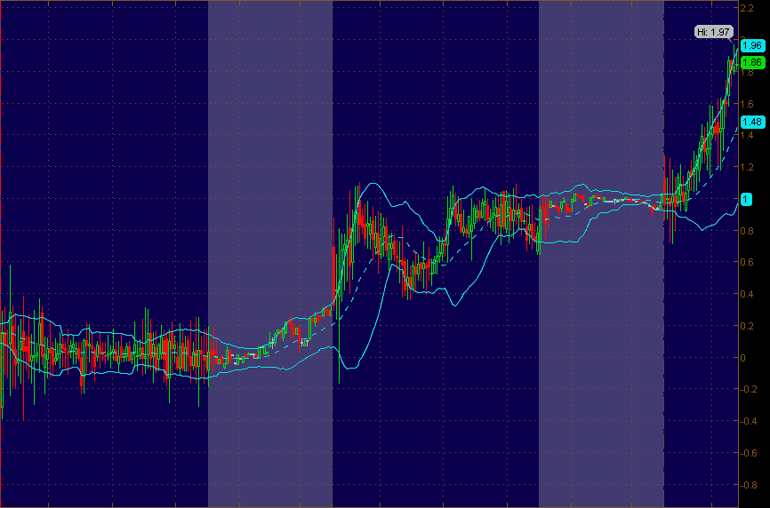

<!--yml

分类：未分类

日期：2024-05-18 16:38:40

-->

# VIX and More: TVIX Premium Spikes to 13%

> 来源：[`vixandmore.blogspot.com/2012/02/tvix-premium-spikes-to-13.html#0001-01-01`](http://vixandmore.blogspot.com/2012/02/tvix-premium-spikes-to-13.html#0001-01-01)

今天正常交易时段超过两小时后，[TVIX](http://vixandmore.blogspot.com/search/label/TVIX)的溢价为其[日内指示价值](http://vixandmore.blogspot.com/search/label/intraday%20indicative%20value)的 13.5%以上。

下面的图表显示了过去三个交易日内 TVIX 和 TVIX.IV 之间的差异，使用 5 分钟柱状图，并将延长交易时间的交易区块染成灰色。

在这个时刻，多头可能正在赌一个短期挤压的可能性，或许与 VIX 的飙升相结合，可能会给他们带来一些可观的意外利润。另一方面，空头则认为， Credit Suisse ([CS](http://vixandmore.blogspot.com/search/label/CS)) 重新开放 TVIX 的创建单位窗口只是时间问题，这将恢复供求平衡，并通过不同类型的意外利润消除 13%的溢价。

*[我的政策通常是不对个别持股发表评论，除非在下面的披露部分提及，但足以说明，随着 TVIX 溢价的增加，我越来越难以预期溢价的进一步扩大。]*

相关文章：

**

*[来源(s): thinkorswim/TD Ameritrade]*

***披露(s):*** *写作时做空 TVIX*
