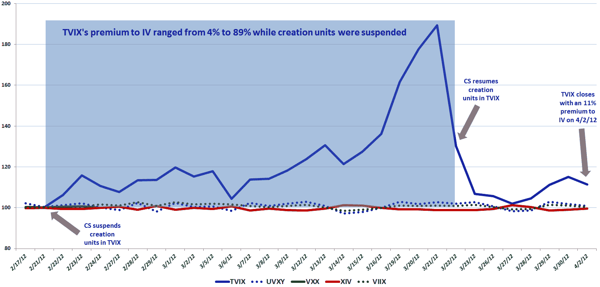

<!--yml

category: 未分类

date: 2024-05-18 16:33:59

-->

# VIX and More: TVIX Premium to Indicative Value Creeping Back Up…

> 来源：[`vixandmore.blogspot.com/2012/04/tvix-premium-to-indicative-value.html#0001-01-01`](http://vixandmore.blogspot.com/2012/04/tvix-premium-to-indicative-value.html#0001-01-01)

如果你认为[TVIX](http://vixandmore.blogspot.com/search/label/TVIX)（VelocityShares 每日 2 倍 VIX 短期 ETN）的故事已经过去，你可能要再想一想。

不，我不是在谈论最近的[新闻](http://www.reuters.com/article/2012/03/30/us-finra-etns-idUSBRE82S1B520120330)，即 FINRA 正在“关注与 TVIX 相关的事件和交易”，以及监管机构“正在审查与 ETN 和其他复杂产品相关的一系列问题”。

相反，我的兴趣在于在过去三天内，TVIX 相对于其[日内指示价值](http://vixandmore.blogspot.com/search/label/intraday%20indicative%20value)（根据其基础证券的最新价格实时估算的 ETP 的公允价值）出现了一些有意义的溢价。

为了一些历史视角，考虑到在瑞士信贷（[CS](http://vixandmore.blogspot.com/search/label/CS)）[暂停创建单位](http://vixandmore.blogspot.com/2012/02/credit-suisse-suspends-creation-units.html)之前的几个月，TVIX 通常以比其指示价值高约 0.5% 的溢价交易。在创建单位被暂停之后，这个溢价剧烈波动（如下图所示），尽管在几周内，溢价锁定在一个相对较窄的范围内，即 10-20%。该溢价超过指示价值在宣布瑞士信贷恢复创建单位的前一天激增至 89%。一旦宣布恢复创建单位，TVIX 中的溢价在短短三天内迅速回落至 2%，毫无疑问，这向许多人表明 TVIX 交易很快将恢复正常。

然而，在过去三天中，TVIX 的溢价基本保持在 10-15% 的范围内，今天收盘时为 11.4%。

这里的一种肤浅的结论是，瑞士信贷可能正在考虑再次暂停 TVIX 创建单位的可能性。另一种解释是，尽管瑞士信贷表示他们将“有限地”重新开放 TVIX 的发行，但现在很可能 TVIX 创建单位的有限流量并不足以建立 TVIX 和 TVIX.IV 之间的价格等价，这表明供求不平衡仍在持续。考虑到过去三天的低交易量，我倾向于相信这种不平衡更多地是供应限制而不是过剩需求的问题，但在这里，数据的简单解释可能不是恰当的解释。

TVIX 溢价的波动在将来会非常有意思地观察。有人可能会认为，尽管我写了关于 TVIX 的许多文章，包括一个（在暂停前）[提醒](http://vixandmore.blogspot.com/2012/02/will-tvix-go-to-zero.html)文章，该文章明确指出，ETN 的长期预期价值为零，但许多投资者在购买 TVIX 股份时并不知道他们买了什么。自从创建单位暂停以来六周，公众对此问题有了相对全面但有时痛苦的教训，即使其中一些可能来得太晚，无法避免巨大损失。

这个更明智、受教育程度更高的投资者阶层能帮助创造 TVIX 溢价的另一大波吗？我持怀疑态度，但肯定会认真关注。记住，任何为 TVIX 支付 11%的溢价超过公平价值的人都应该预计到溢价将在不久的将来蒸发，而且任何短期内的收益都可能来自于其他愿意支付更高的溢价来拥有一个可能会表现不佳[UVXY](http://vixandmore.blogspot.com/search/label/TVIX)的 ETN 的投资者。

editorial aside,尽管 TVIX 在宣传方面可能遭受打击，但如果这款产品在 2008 年金融危机之前推出，我几乎没有怀疑过，许多投资者会在股市过渡到后雷曼兄弟时代的恐怖期间对其顶礼膜拜。

相关文章：

来源：[thinkorswim/TD Ameritrade，雅虎](https://source.example.org/)

****Disclosure(s****): 写作时持有 TVIX 和 UVXY 的空头仓位*
