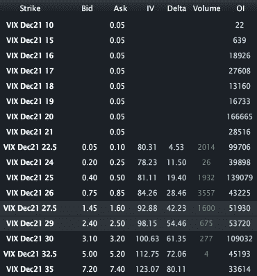

<!--yml

category: 未分类

date: 2024-05-18 16:46:44

-->

# VIX 和更多：在 VIX 期权（和 ETP）中获利

> 来源：[`vixandmore.blogspot.com/2011/12/taking-profits-in-vix-options-and-etps.html#0001-01-01`](http://vixandmore.blogspot.com/2011/12/taking-profits-in-vix-options-and-etps.html#0001-01-01)

今天交易两小时后，我昨天提到的交易想法，[做多 VIX 看跌期权](http://vixandmore.blogspot.com/2011/12/vix-puts-looking-attractive.html)，表现得非常好。VIX 12 月 27.50 看跌期权上涨了 50%以上，而 12 月 30 看跌期权上涨了约 45%。

我认为，与大多数其他证券的期权相比，VIX 期权在何时以及如何获利方面要复杂得多。VIX 期权获利具有额外的复杂性和难度，其中一个重要原因是波动性的一般倾向以及 VIX 的特别倾向——均值回归。

另一个关于管理 VIX 期权头寸的潜在复杂因素与它们的底层资产有关。我希望到目前为止，阅读这个博客的读者已经多次了解到，[VIX 期货](http://vixandmore.blogspot.com/search/label/VIX%20futures)是 VIX 期权的最佳代理，而不是现金 VIX 或 VIX 指数，后者是在媒体中最常引用的 VIX。任何持有 VIX 期权头寸的人——以及[VIX ETP](http://vixandmore.blogspot.com/search/label/VIX%20ETN)）——都应该监控 VIX 期货。

观察交易前两小时的变化，我们可以看到典型的模式：当月（12 月）VIX 期货（-6.3%）的变动大约是现金 VIX（-7.9%）的 80%，而下一个月（1 月）的期货（-4.4%）的变动大约是现金 VIX 的 56%。这与历史常态相符。作为一个额外的数据点，[VXX](http://vixandmore.blogspot.com/search/label/VXX)，它是由当月和下一个月 VIX 期货的组合，下跌了大约 4.7%，这是合理的，因为在这个期权到期周期的这个阶段，持有不成比例的当月期货。

那么这对 VIX 期权中的获利意味着什么呢？

首先，我无法过分强调监控 VIX 期货并理解它们与现金 VIX 关系的重要性。

其次，由于 VIX 有均值回归的倾向，因此经常反转近期在任一方向上的大幅变动，因此当有幸从波动性的显著有利变动中受益时，至少要部分获利。例如，如果我的 VIX 期权增值 50%，我喜欢获利 25%或 50%的仓位。

第三，要记住上述提到的长期 VIX 看跌期权仍然处于虚值状态，没有内在价值。因此，它们每天都会受到显著的[时间衰减](http://vixandmore.blogspot.com/search/label/time%20decay) ([theta](http://vixandmore.blogspot.com/search/label/theta))的影响，如果没有额外的有利波动变动，它们将会失去价值。

总之，收获 VIX 利润可能是一个具有挑战性的任务，应该被视为艺术和科学的结合。只需查看许多类似尖塔形状的[VIX 波动](http://vixandmore.blogspot.com/search/label/VIX%20spikes)，就会明白 VIX 期权中的大额利润机会是多么短暂。

此外，谁知道下一个来自欧洲的谣言会是什么，大众会恐慌还是消除恐慌。

相关文章：

 

**来源：[LivevolPro.com]*

**披露：** 在撰写本文时，持有短期 VXX；Livevol 是 VIX 和 More 的广告商。
