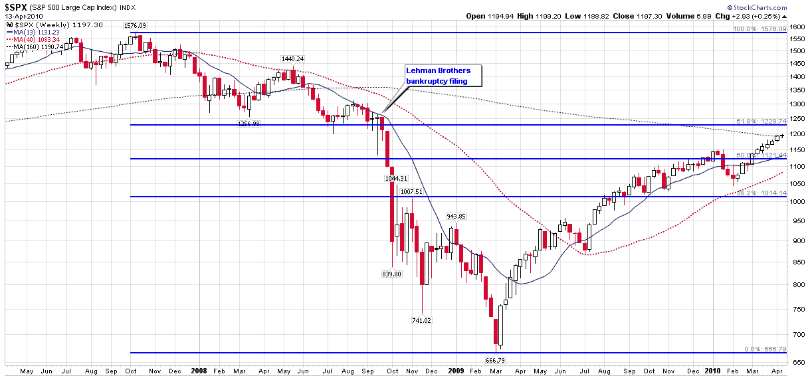

<!--yml

分类：未分类

日期：2024-05-18 17:11:52

-->

# VIX and More: Technical Resistance Looms in S&P 500 Index

> 来源：[`vixandmore.blogspot.com/2010/04/technical-resistance-looms-in-s-500.html#0001-01-01`](http://vixandmore.blogspot.com/2010/04/technical-resistance-looms-in-s-500.html#0001-01-01)

由于英特尔（[INTC](http://vixandmore.blogspot.com/search/label/INTC)）盘后发布了强劲的财报，股指期货指向明天早上开盘走强，标普 500 指数很可能向 1200 点发起冲击。

现在许多评论员已经公开表示股票过度延伸，这似乎是时候打出斐波那契回撤牌，并指出 SPX 面临重要的技术阻力，特别是在 1225 点及其以上区域。

正如下面这张图表（三年，周线）所示，SPX 1225 在技术上具有多重意义。首先，1228 是 2007 年 10 月高点至 2009 年 3 月低点的 61.8%回撤位。其次，SPX 1225-1250 区域恰好位于雷曼兄弟申请破产保护前的那个周五指数收盘价（1251）之下。再往前看，1225-1250 区域也定义了 2008 年 3 月（贝尔斯登）低点和 7 月初的后续低点。

简单总结一下，SPX 指数首先必须攻克心理重要的 1200 点关口，上次收盘价高于该水平还是在 2008 年 9 月 26 日。在 1200 点的另一侧，有一个关键的斐波那契回撤位，以及雷曼兄弟、贝尔斯登等机构的阴霾。

当然，股票有可能会继续无视重力，轻松越过这些障碍，但我怀疑技术阻力终于要放下手套进行反击了。

关于相关主题的更多内容，读者可以查阅：

来源：[StockCharts.com]*

***披露：*** *无*
