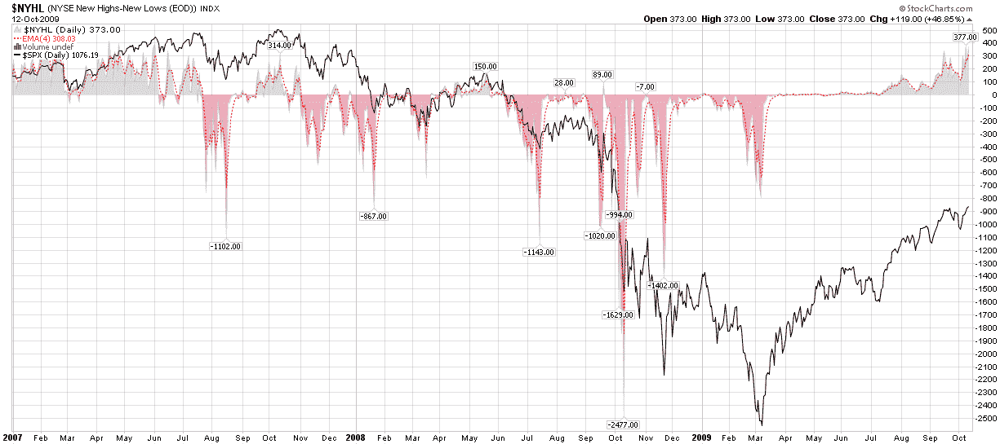

<!--yml

分类：未分类

date: 2024-05-18 17:26:36

-->

# 维克斯和更多：52 周回溯期与新高低

> 来源：[`vixandmore.blogspot.com/2009/10/52-week-lookback-period-and-new.html#0001-01-01`](http://vixandmore.blogspot.com/2009/10/52-week-lookback-period-and-new.html#0001-01-01)

[市场广度](http://vixandmore.blogspot.com/search/label/breadth) 是一个很好的工具。它可以用来评估动能，也可以作为 逆市场 指标，帮助识别潜在的市场反转。各种广度指标从简单的涨跌指标，如 [麦克尔森综合指数](http://vixandmore.blogspot.com/search/label/McClellan%20Summation%20Index)，到新高和新低测量，等等。

最近几周，我看到了不少关于 52 周新高低的评论，我想指出我认为对每个人来说都应该 obvious 的事情。首先，在许多方面，52 周的时间框架是 an arbitrary lookback period。很容易使用 3 个月、6 个月、2009 年至今、2 年或 whatever 的回溯期。碰巧的是，52 周是几乎所有新高低数据中 conventional 的回溯期。

我之所以提这么多，是因为 2008 年 10 月 1 日至 2008 年 10 月 10 日，标普 500 指数 free fall 式下跌，从 1167 跌至 839。结果，现在有很多股票创 52 周新高 only because 回溯期 no longer 包括 free fall 前的值。

所以…要密切关注市场广度，但要注意 10 月份以来新高的 artificial jump，这很大程度上是任意回溯期的 function。换言之，如果你要成为技术分析的学生，一定要研究 not just 近期数据，也要研究正在 off radar 的数据。

*[图形: 股票图表]*
