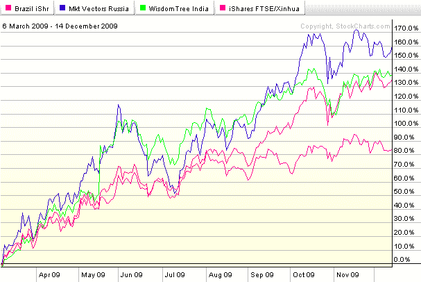

<!--yml

分类：未分类

日期：2024-05-18 17:20:02

-->

# VIX 和更多：BRIC 牛市

> 来源：[`vixandmore.blogspot.com/2009/12/bric-bull.html#0001-01-01`](http://vixandmore.blogspot.com/2009/12/bric-bull.html#0001-01-01)

上次我写关于[BRIC](http://vixandmore.blogspot.com/search/label/BRIC)国家相对表现的时间是大约八个月前，在[俄罗斯引领 BRIC 反弹](http://vixandmore.blogspot.com/2009/04/russia-leading-bric-rally.html)一文中。当时，从三月底的低点反弹只有一个月的样子，[俄罗斯](http://vixandmore.blogspot.com/search/label/Russia) ([RSX](http://vixandmore.blogspot.com/search/label/RSX)) 走在前面，紧接着是[印度](http://vixandmore.blogspot.com/search/label/India) ([EPI](http://vixandmore.blogspot.com/search/label/EPI))，而[巴西](http://vixandmore.blogspot.com/search/label/Brazil) ([EWZ](http://vixandmore.blogspot.com/search/label/EWZ))和[中国](http://vixandmore.blogspot.com/search/label/China) ([FXI](http://vixandmore.blogspot.com/search/label/FXI))的涨幅并不那么明显。

快进八个月，俄罗斯仍然领先，但开始看起来有点疲惫。尽管人们热议中国泡沫，但中国最受欢迎的 ETF——FXI，与其他 BRIC ETF 相比，排名第四且差距越来越大。自十月底以来，表现最好的是印度和巴西。事实上，印度 ETF（EPI）现在的表现比雷曼兄弟破产前一天高出 21%，而巴西 ETF 的表现比雷曼兄弟破产前一周高出 29%。

展望 2010 年，我认为俄罗斯将很难保持领先地位。我不惊讶看到巴西超越其他国家，然后是印度和一个复苏的中国。有一点是确定的：如果投资者能预测 2010 年 BRIC ETFs 的困境，那么投资拼图中的其他许多部分将神奇地开始到位。

关于相关主题，读者可以查阅以下内容：

**[来源：StockCharts]*

****披露：*** *无*
