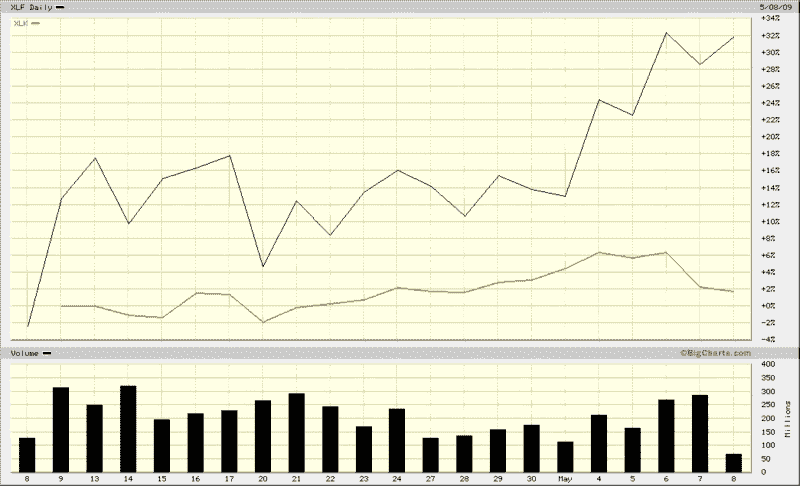

<!--yml

分类：未分类

日期：2024-05-18 17:48:22

-->

# VIX and More: 银行股 vs. 科技股

> 来源：[`vixandmore.blogspot.com/2009/05/banks-vs-technology.html#0001-01-01`](http://vixandmore.blogspot.com/2009/05/banks-vs-technology.html#0001-01-01)

我本打算发一篇关于科技领域近期负面分歧的文章，特别是那些主导纳斯达克 100 指数（[NDX](http://vixandmore.blogspot.com/search/label/NDX)）的大型科技公司，但我觉得 Cam Hui 已经在昨天早上于其博客[Humble Student of the Markets](http://humblestudentofthemarkets.blogspot.com/)中先行一步，在优秀的文章[Weak Leadership Imperils Market Advance](http://humblestudentofthemarkets.blogspot.com/2009/05/weak-leadership-imperils-market-advance.html)中提到了这个问题。

有趣的是，自 Cam 的文章发表以来，金融和科技之间的分歧随着银行股在压力测试结果发布前后的持续上涨而加剧，而大型科技股自周一以来一直在下跌。

到目前为止，金融股（[XLF](http://vixandmore.blogspot.com/search/label/XLF)）在引领市场上涨方面的表现优于科技股（[XLK](http://vixandmore.blogspot.com/search/label/XLK)），因为后者并没有激起空头的情绪。不过，除非这两个板块开始协同行动，否则我认为我们可能会陷入僵局。

来源：[BigCharts](http://vixandmore.blogspot.com/search/label/BigCharts)
