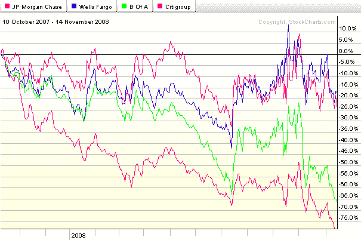
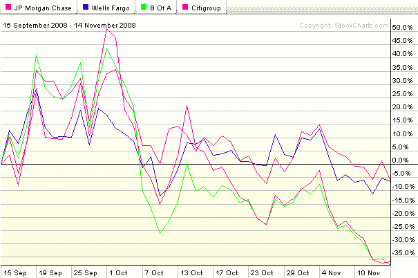

<!--yml

分类：未分类

日期：2024-05-18 18:16:03

-->

# VIX 和更多：美国四大银行

> 来源：[`vixandmore.blogspot.com/2008/11/big-four-us-banks.html#0001-01-01`](http://vixandmore.blogspot.com/2008/11/big-four-us-banks.html#0001-01-01)

2008 年的事件完全重塑了美国商业银行行业的格局。目前看来，似乎有四家大型银行将成为主导玩家：两家相对较强；还有两家面临更具挑战性的竞争环境。这里的图表很好地识别了这些玩家。从 2007 年 10 月的峰值以来，富国银行([WFC](http://vixandmore.blogspot.com/search/label/WFC))和摩根大通([JPM](http://vixandmore.blogspot.com/search/label/JPM))的股价各自下跌了约 20%，远低于金融板块 ETF，即[XLF](http://vixandmore.blogspot.com/search/label/XLF)的 50%跌幅。在另一端的是美国银行([BAC](http://vixandmore.blogspot.com/search/label/BAC))和花旗集团([C](http://vixandmore.blogspot.com/search/label/C))，在这段时间内，它们的股价各自至少下跌了 65%。具体请看顶部的图表。将焦点转移到贝尔斯登破产以来的时期（底部的图表），这种模式更为戏剧化，WFC 和 JPM 的股价各自下跌了超过 5%，而 BAC 和 C 的股价下跌了超过 35%。

XLF 在周四创下了 11.70 的新低，在我写下这些文字时，其交易价格大约在 12.00。如果 XLF 和大型商业银行无法勉强触底，那么这个市场将无法维持任何反弹。更好的做法，还应将[XHB](http://vixandmore.blogspot.com/search/label/XHB)（房地产开发商）和[XLY](http://vixandmore.blogspot.com/search/label/XLY)（消费品非必需品部门）加入该列表。要想实现可持续的反弹，将需要 XLF、XHB 和 XLY 的参与。

来源：StockCharts
