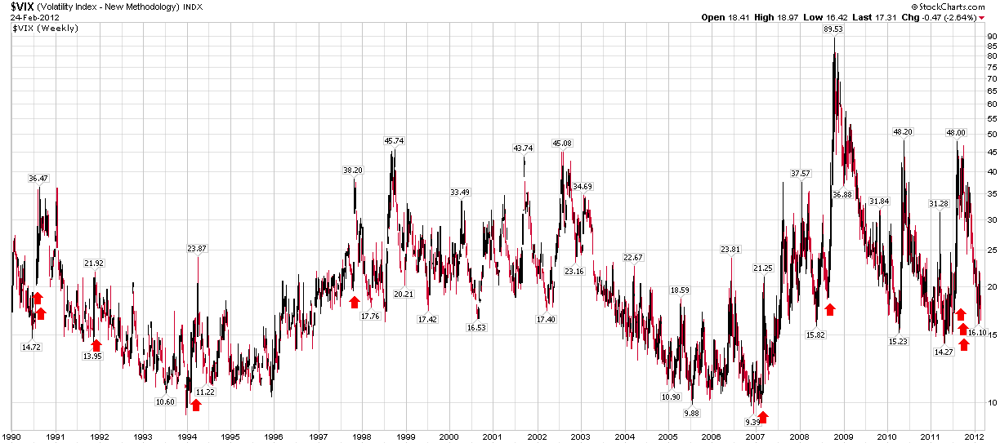

<!--yml

分类：未分类

日期：2024-05-18 16:38:04

-->

# VIX 和更多：有史以来最大的 VIX 波动回顾

> 来源：[`vixandmore.blogspot.com/2012/02/biggest-vix-spike-ever-retrospective.html#0001-01-01`](http://vixandmore.blogspot.com/2012/02/biggest-vix-spike-ever-retrospective.html#0001-01-01)

这里有一个思想实验：有记录以来最大的单日[VIX 波动](http://vixandmore.blogspot.com/search/label/VIX%20spikes)是在什么时候？如果你说是[2007 年 2 月 27 日](http://vixandmore.blogspot.com/search/label/February%2027)——今天五年前——那么我想你可能是少数派之一，即使是在 VIX 产品的活跃交易者中。

当时有多个因素触发了 2007 年几乎被遗忘的记录 VIX 波动——其中 S&P 500 指数下跌了 3.5%。当时的多数媒体报道都集中在中国的股票下跌上。实际上，正如我[后来所指出](http://vixandmore.blogspot.com/2009/02/volatility-storm-at-two-years-and.html)，中国政府提高利率以抑制投机的行为帮助触发了上海综合指数下跌 8.8%，以及基于流行中国 ETF 的 FTSE/Xinhua 中国 25 指数下跌 9.9%。其他一些新闻报道指出美国经济数据令人担忧，还有一些人被塔利班在阿富汗针对副总统迪克·切尼的自杀性爆炸攻击吓坏了。

有趣的是，当时对于次贷危机或房地产泡沫的担忧几乎无处可寻。

当然，2007 年的世界要大得多。我在 VIX 波动前的一个月开始写博客，在一个 VIX 低于 10 是很常见的世界里，我在博客上添加了这句俏皮的副标题：“您的 VIX 宇宙一站式视图……”Twitter 当时还处于起步阶段，CNBC 甚至还没有考虑在电视屏幕上运行 VIX 计数器的主意，当时大多数人甚至不知道 VIX 是什么。

对于那些可能对金融考古感兴趣的人来说，那天我发布了八篇文章来记录市场的巨大波动，并为寻求更多信息的人提供了解释性总结：

然后在第二天开盘前另一篇文章中加入了一些交易想法：

请注意，当时的博客世界要小得多，也更加亲密，所以我并不惊讶地看到[大卫·梅尔克](http://alephblog.com/)，[交易女神](http://www.tradinggoddess.com/)，[期权评论家](http://www.optionpundit.net/)，[吉姆·金斯兰](http://buttonwood1792.blogspot.com/)，Headline Charts，Lauriston Letter 和其他那个时代的博客名人光临评论板块，分享他们的想法。

当然，通常在这里我会被无数个“那么 VIX 的一天内的巨大波动意味着什么？”的问题所困扰，所以我擅自将过去 22 年中（包括重建的 VIX 计算）十大单日 VIX 波动最大的日子标了出来。在我看来，这些一日内的波动通常是一些投资者突然首次看到一只暗灰色的黑天鹅的时刻，他们惊慌失措，不知道下一步会发生什么。在大多数情况下，这种恐慌最终被证明是反应过度的。当然，偶尔的巨大波动在回顾时看起来可能是末日的先兆，就像 2008 年 9 月 29 日，VIX 波动了 34.5%，就在股市暴跌之前。然而，每当我看到 VIX 的巨大波动时，我首先会做的是拿出我的[均值回归](http://vixandmore.blogspot.com/search/label/mean%20reversion)交易工具包。

相关文章：

来源：[StockCharts.com](https://example.org)

**披露：** *在撰写本文时持有 FXI*
