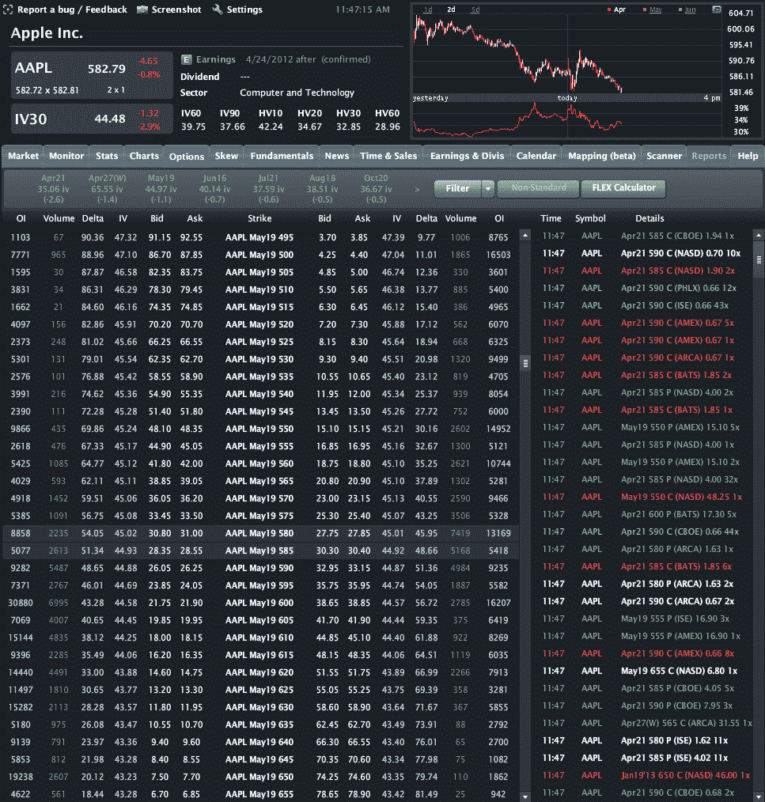

<!--yml

category: 未分类

date: 2024-05-18 16:32:16

-->

# VIX 和更多：出售苹果看跌期权的案例

> 来源：[`vixandmore.blogspot.com/2012/04/case-for-selling-apple-puts.html#0001-01-01`](http://vixandmore.blogspot.com/2012/04/case-for-selling-apple-puts.html#0001-01-01)

最近，似乎每个有键盘的人都对苹果公司（AAPL）的两周卖盘感到兴奋 ([AAPL](http://vixandmore.blogspot.com/search/label/AAPL))。我本想称这 为调整，但实际上，哪个更准确：AAPL 的 644 美元还是 582 美元？那 Topeka Capital Markets 分析师将股价目标定为 1001 美元又如何？

由于周二将公布收益，因此有关可能的收入超额和不足、产品管道的可能产出等传言四处流传。

有很多投资者想要拥有 AAPL 或增持现有仓位。其中许多人认为 582 美元的股票是一个很好的价值，但担心可能出现负面收益惊喜，因此他们不确定该怎么做。

昨天我发布了以下交易想法：

> *“简单想法：选择一个价格，在该价格你想要拥有 AAPL，然后出售看跌期权”*
> 
> **“$AAPL May 520 puts at 7.25\. Think of it as being paid 7.25 to see if you can get the stock at a $70 discount”**

我喜欢期权的其中一个原因是它们允许如此多的交易灵活性。Jared Woodard of [Condor Options](http://condoroptions.com/)喜欢说期权允许用一种[更细腻的语言](http://condoroptions.com/2011/09/08/what-options-are-good-for/)来表达对市场的看法。与其争论 AAPL 在 582 美元时是否买入，更好的问题是，“我认为 AAPL 可能会以多低的‘臭价’成交，并且我能为此出价得到多少报酬？”

查看下方的 AAPL 期权图表，5 月 550 美分的看跌期权（右栏）目前价格为 15.10 美元，所以如果到期的看跌期权处于实值状态，这些股票的净成本将为 535 美元。昨天提到的 5 月 520 美分的看跌期权仍可 以以 7.25 美元的价格购买，这意味着成本基础大约为 513 美元。甚至可以出售 5 月 500 美分的看跌期权，价格为大约 4.30 美元，这意味着成本基础大约为 496 美元。

所以如果你真的想拥有 AAPL 并且不想承担下周收益公告的所有风险，可以考虑出售一些虚值看跌期权。你可以为这些看跌期权收取一些溢价，如果最坏的情况成真，你也可以将股票锁定在今天的价格折扣。

最后，对于那些可能想关注我的人[Twitter](http://vixandmore.blogspot.com/search/label/Twitter)，你可以在[Twitter.com/VIXandMore](http://twitter.com/VIXandMore)找到@VIXandMore

相关帖子：

**[来源(s)：LivevolPro.com]**

***披露(s)：*** *Livevol 是 VIX and More 的广告商**
