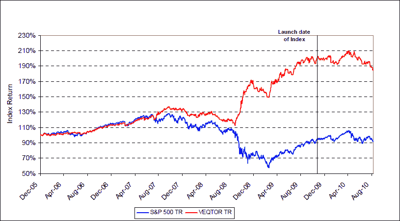

<!--yml

类别：未分类

日期：2024-05-18 17:01:15

-->

# VIX 和更多：VQT 的案例

> 来源：[`vixandmore.blogspot.com/2010/10/case-for-vqt.html#0001-01-01`](http://vixandmore.blogspot.com/2010/10/case-for-vqt.html#0001-01-01)

许多投资者，包括现在的我，都从 2009 年 3 月以来的长期头寸中获得了可观的收益。随着标普 500 指数从最近的 7 月 1 日低点 1010 上涨 16%，并看起来可能很快再次冲击 1200，多头们在一方面渴望锁定一些利润，另一方面则希望从进一步的上涨中受益。

虽然解决这个问题有多种方法，但随着巴克莱 ETN+ S&P VEQTOR ETN ([VQT](http://vixandmore.blogspot.com/search/label/VQT))于 9 月 1 日的推出，一种新的现成策略变得可用。

简要回顾一下，VQT 本质上是一个包含两个组件的投资组合：一个长期 SPY 组件和一个长期[VXX](http://vixandmore.blogspot.com/search/label/VXX)组件。每天结束时，ETN 评估波动风险，并根据包括[实现波动率](http://vixandmore.blogspot.com/search/label/realized%20volatility)和[隐含波动率](http://vixandmore.blogspot.com/search/label/implied%20volatility)的规则确定 SPY 头寸应如何用 VXX 进行[对冲](http://vixandmore.blogspot.com/search/label/hedging)。结果是一个动态对冲的多头头寸，用波动率进行对冲。VQT 的 SPY 组件设定在 60-97.5%的范围内变化，VXX 组件在 VQT 中构成 2.5-40%的平衡。 VQT 还有另一个其他波动率 ETN 没有的引人注目的投资组合分配特征： 止损规定，该规定优先于所有其他分配。 当 VQT 的 5 日回报率下降至-2%以下时，该止损规定被触发，此时 ETN 的投资组合会自动切换至 100%现金，并在 5 日回报率上升至-2%以上之前保持 100%现金。

下面的图表显示，VQT 不仅旨在在波动性增加的环境中限制损失，而且在某些高波动性情景下也能获利。

由于 VQT 可能是最复杂的[主动管理](http://vixandmore.blogspot.com/search/label/actively%20managed%20ETFs) ETN 之一，我强烈建议读者研究 VQT 的[定价补充文件](https://ecommerce.barcap.com/investorsolutions/contentStore.app?id=185332)，其要点我已在[巴克莱 VEQTOR ETN (VQT) 开始交易](http://vixandmore.blogspot.com/2010/09/veqtor-etn-vqt-begins-trading.html)中概述。

最后，我感到有必要提及，截至目前，VQT 平均每天只交易约 5,000 股。虽然市场深度不大，但买卖价差始终在约 0.06 的范围内——考虑到 VQT 的交易价格在我撰写本文时超过 105，这并不算差。与任何奇异型 ETN 一样，没有保证 VQT 能吸引足够兴趣，成为投资领域的一个永久性特征，这将是件遗憾的事，因为我相信这个 ETN 具有巨大的潜力。

对于那些认为将来可能对这款产品感兴趣的人来说，我只有一个建议：用它或者失去它！

相关文章：

**[来源：巴克莱]**

**披露声明：** 在撰写本文时，持**长期 VQT**和**短期 VXX**头寸**
