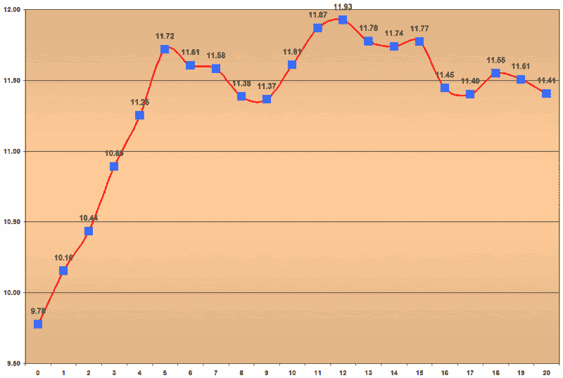

```yaml

分类：未分类

日期：2024-05-18 16:00:32

-->

# VIX 和更多：合成低于 10 点的 VIX 反弹

> 来源：[`vixandmore.blogspot.com/2007/02/composite-sub-10-vix-bounce.html#0001-01-01`](http://vixandmore.blogspot.com/2007/02/composite-sub-10-vix-bounce.html#0001-01-01)

【昨天](http://vixandmore.blogspot.com/2007/02/bouncing-back-from-sub-10-vix.html)我们研究了过去 17 年中从低于 10 点的 VIX 收盘价反弹的九次不雅观的彩虹海德拉。今天我们的意图是以合成视图的形式从那片混乱中带来秩序，其中合成图景比单个故事讲述得更简洁：



简而言之，合成图景是一个五天的上升紧接着低于 10 点的收盘，之后有些横向的曲折，总体在 12 天后达到高峰，最后逐渐回到较低水平。

今天的第九天收盘价为 10.65，是迄今为止最低的第九天收盘价。如果当前模式保持不变，我们将会有一个超过半点的三天上升，随后在接下来的十天内逐渐回到当前水平。作为提醒，应注意当前的“反弹”已经产生了 5-9 天内的最低点，有很强的可能性，第三天的 11.46 高点将保持为 10 点以下收盘后的 20 天内的最高值。

为了打乱这种思维并暂时离开对低于 10 点收盘的讨论，今天只是过去 13 年中 VIX 的 20 日移动平均第三次创新低。上次发生这种情况是在 2006 年 11 月 22 日，VIX 在三天内上涨了 15%，在十天内上涨了 25%。在此之前，上一次新的 20 日移动平均低点是在 1994 年 1 月 10 日，当时 VIX 在三天内上涨了 13%，在 20 天内上涨了 30%。

通常，我更倾向于关注相对 VIX 值而不是绝对值。我怀疑本周剩余时间会告诉我们应该遵循哪个脚本。
