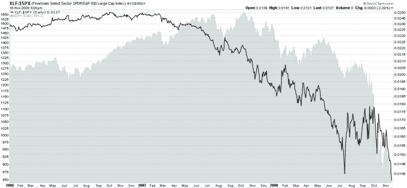

<!--yml

category: 未分类

date: 2024-05-18 18:15:28

-->

# VIX and More: 金融板块的沉重负担

> 来源：[`vixandmore.blogspot.com/2008/11/concrete-shoes-of-xlf.html#0001-01-01`](http://vixandmore.blogspot.com/2008/11/concrete-shoes-of-xlf.html#0001-01-01)

最近有很多日子，市场看起来仿佛穿上了“混凝土鞋子”，永远无法将头伸出水面。一次又一次，金融板块看起来就像那些混凝土鞋子：金融板块暴跌；市场紧随其后。

事实上，自 2006 年 10 月初金融板块相对于大盘的表现以来，一直在稳步减弱，当时金融板块（[XLF](http://vixandmore.blogspot.com/search/label/XLF)）相对于标普 500 指数（SPX）的比率达到了顶峰。下面的图表从 2006 年初开始追踪这个比率，并显示了金融板块是如何拖累大盘的。此外，图表还揭示出，比率 almost every 暂时的改善都是一个绝佳的空头机会。

图表也显示，比率的暂时性底部给出了一些可交易但寿命短暂的多头机会。今天早上，XLF 和 XLF:SPX 比率再次创下新低。最终，比率会找到一个底部。如果图表中的模式保持真实形态，比率的底部将会先于 SPX 的底部出现。

[source: StockCharts]
