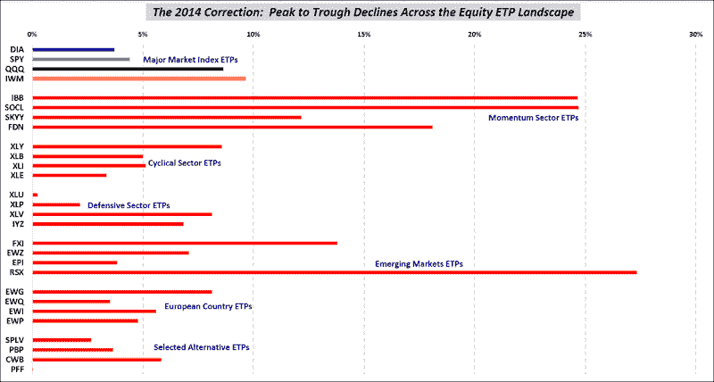

<!--yml

分类：未分类

日期：2024-05-18 16:10:36

-->

# VIX 和更多：在 ETP 景观中看到的回调

> 来源：[`vixandmore.blogspot.com/2014/04/the-correction-as-seen-in-etp-landscape.html#0001-01-01`](http://vixandmore.blogspot.com/2014/04/the-correction-as-seen-in-etp-landscape.html#0001-01-01)

自 2009 年 3 月股票触底以来，我定期发布[SPX 回调表](http://vixandmore.blogspot.com/2014/02/a-very-middling-pullback-so-far.htmlhttp:/vixandmore.blogspot.com/2013/06/all-about-pullback-from-spx-1687.html)和偶尔的[所有这些回调和它们持续时间的图表](http://vixandmore.blogspot.com/2013/04/four-years-of-spx-pullbacks-in-one-plot.html)。然而，近期股票的抛售却远非 SPX 回调。我曾考虑提供纳斯达克综合指数或纳斯达克 100 指数([NDX](http://vixandmore.blogspot.com/search/label/NDX))的可比数据，但在这里，纳斯达克宇宙中的一些领域的抛售程度不成比例，尽管它比 SPX 受到的打击更严重。

这次我选择了一张图表，展示了股息 ETP 宇宙的顶点到底部的回调，重点关注我认为最重要的板块群体。

](http://lh4.ggpht.com/-9Ep62l-FC1w/U35eOacAFmI/AAAAAAAAIyI/1YAc7onT8sA/s1600-h/ETP%252520Landscape%2525202014%252520DDs%252520041514%25255B11%25255D.png)

*[来源(s): Yahoo, VIX 和更多](http://vixandmore.blogspot.com/search/label/IWM)*

上述数据仅涵盖 2014 年，并指示自 2014 年峰值以来的最大回调。尽管许多最大回调是在今天早些时候出现的，但今年年初确立最大回调的情况也有很多。

请注意，尽管纳斯达克吸引了大部分关注，但在主要市场指数 ETP 中，小市值股票([IWM](http://vixandmore.blogspot.com/search/label/IWM))遭受的损失最为严重。

不出所料，生物科技([IBB](http://vixandmore.blogspot.com/search/label/IBB)),社交媒体([SOCL](http://vixandmore.blogspot.com/search/label/SOCL))和俄罗斯([RSX](http://vixandmore.blogspot.com/search/label/RSX))遭受了最大跌幅，但在周期性股票、防御性股票和欧洲国家 ETP 中，选择很少。

最后，为了好玩，我增加了四个带有股息特色的替代 ETP([SPLV](http://vixandmore.blogspot.com/search/label/SPLV), [PBP](http://vixandmore.blogspot.com/search/label/PBP), [CWB](http://vixandmore.blogspot.com/search/label/CWB)和[PFF](http://vixandmore.blogspot.com/search/label/PFF))，以展示低波动性、覆盖式看涨期权、可转换债券和优先股 ETP 的表现如何。

相关文章：

***披露(s):*** *无*
