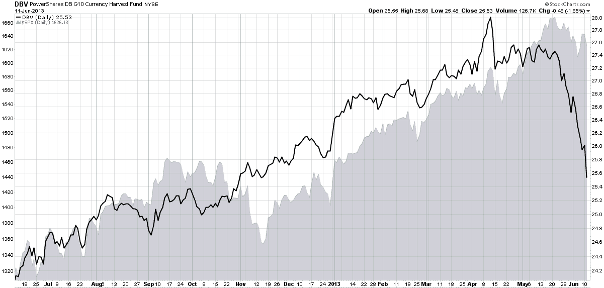

<!--yml

category: 未分类

date: 2024-05-18 16:16:17

-->

# VIX 和更多：货币 carry trade，DBV 和风险

> 来源：[`vixandmore.blogspot.com/2013/06/the-currency-carry-trade-dbv-and-risk.html#0001-01-01`](http://vixandmore.blogspot.com/2013/06/the-currency-carry-trade-dbv-and-risk.html#0001-01-01)

在过去五年里活跃于金融市场的人都清楚，风险有许多种[:](http://vixandmore.blogspot.com/search/label/risk)，有许多种思考和衡量风险的方式，而且不可避免地，总有一些风险潜伏在下一个角落，许多人从未费心去思考。大多数投资者倾向于关注股票，因此倾向于用 CBOE 波动指数（VIX）这个数字来评估市场的相对风险、不确定性或可能的恐惧水平。话说回来，在过去的几年里，几乎每个人都已经对诸如[信用违约掉期](http://vixandmore.blogspot.com/search/label/credit%20default%20swaps)[:](http://vixandmore.blogspot.com/search/label/credit%20default%20swaps)，[TED 利差](http://vixandmore.blogspot.com/search/label/TED%20spread)[:](http://vixandmore.blogspot.com/search/label/TED%20spread)，LIBOR-OIS 利差[:]，银行资本比率[:]和许多其他概念和统计数据变得熟悉，而这些在 2007 年他们的雷达上还找不到。

为了更全面地评估风险，我们总是可以参考[圣路易斯联邦储备银行的金融压力指数](http://vixandmore.blogspot.com/search/label/STLFSI)，这是试图将多种与经济和金融相关的风险因素（总共有[18 种](http://vixandmore.blogspot.com/2010/09/st-louis-feds-financial-stress-index.html)）综合成一个单一的风险指数的一个例子。

许多投资者在市场风险方面仍然挣扎的一个方面是货币 carry trade。如果美元的每日波动对于那些主要关注在美国交易的股票的投资者来说相对不重要，那么对于大多数投资者来说很容易得出结论，认为日元（[FXY](http://vixandmore.blogspot.com/search/label/FXY)）或澳大利亚元（[FXA](http://vixandmore.blogspot.com/search/label/FXA)）的波动可以忽略不计，远不如美元的重要性。不幸的是，情况并不总是如此。结果证明，许多投资者，尤其是大型机构投资者，对于货币 carry trade 有着浓厚的兴趣，这种交易中，一个人以低利率借款，然后用所得资金购买高利率货币的资产。随着日本央行将利率目标定为 0.1%，以及澳大利亚储备银行最近将基准利率降至 2.75%，carry trade 被构建为一种利率差异交易，投资者可以借入日元，然后购买澳大利亚债券，盈利性由净利率差异加上或减去汇率波动决定。

当然，一些更为积极的投资者更喜欢将日元作为购买除债券之外的其他资产的融资货币，包括美国股票。对于持有美国股票的投资者来说，问题在于，当日元大幅升值时——就像上周一和周四，以及今天 session 中一样——持有日元空头头寸的交易者会受到挤压，面临保证金调用和/或强制平仓，这意味着他们不仅要弥补日元空头头寸，还要平掉美国股票的多头头寸，因为两腿都在解除。因此，当日元 carry trade 受到青睐时，美国股市往往与日元的走势相反。交易者可以通过关注 USD/JPY 货币交叉或日元 ETF, FXY 来监控日元的强度。

专注于日元的一个替代方案是监控 PowerShares DB G10 Currency Harvest Fund ([DBV](http://vixandmore.blogspot.com/search/label/DBV))，该基金如 PowerShares 所述，“由某些 G10 货币的货币期货合约组成，旨在利用这样一种趋势：与相对较低利率关联的货币相比，相对较高利率关联的货币平均而言会升值。目前指数选择的 G10 货币组合包括美元、欧元、日元、加拿大元、瑞士法郎、英镑、澳大利亚元、新西兰元、挪威克朗和瑞典克朗。”

换句话说，DBV 是一个始终做多三只货币、做空三只货币的套利交易 ETF，每季度更新这些[持仓](http://www.invescopowershares.com/products/overview.aspx?ticker=DBV#indexweights)。目前，ETF 做空瑞士法郎、欧元和日元，同时做多澳大利亚元、挪威克朗和新西兰元。

如图所示，过去的一年中，DBV 大多数时间都在紧密跟踪标普 500 指数，但近段时间这种关系已经瓦解，因为 DBV 暴跌，而 SPX 只是经历了轻微的回调。往前看，投资者应该密切关注美元/日元交叉盘，FXY ETF（该 ETF 有期权）以及 DBV，因为 DBV 提供了整体套利交易的更广泛画面——同时也可以作为这种交易对股票可能构成的风险的代理。

除了上面提到的产品外，请注意还有一款与 DBV 类似的货币套利交易 ETF，即 iPath 优化货币套利 ETN (*[ICI](http://vixandmore.blogspot.com/search/label/ICI)*)，但这个产品的流动性要低得多。

来源：[StockCharts.com]

相关文章：

***披露信息：*** *无*
