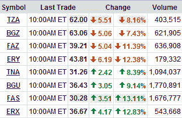

<!--yml

分类：未分类

date: 2024-05-18 18:12:02

-->

# VIX 和更多：Direxion 三重 ETF 革命已经到来！

> 来源：[`vixandmore.blogspot.com/2008/12/direxion-triple-etf-revolution-has.html#0001-01-01`](http://vixandmore.blogspot.com/2008/12/direxion-triple-etf-revolution-has.html#0001-01-01)

三周前的上周五，我以为我可能把自己的头伸得太远了，在[预测：Direxion 三重 ETF 将改变日交易](http://vixandmore.blogspot.com/2008/11/prediction-direxion-triple-etfs-will.html)。好吧，现在我们仅仅过去了三周，这些[三重 ETF](http://vixandmore.blogspot.com/search/label/triple%20ETFs)在今天上午半小时的交易量超过了我在最初预测时整个交易日的交易量。（见下图）

简而言之，革命已经到来。

当然，跟踪误差有些问题，正如 Adam 在[Daily Options](http://adamsoptions.blogspot.com/)中所指出的[三重乐趣](http://adamsoptions.blogspot.com/2008/12/triple-fun.html)。然而，在日内交易中，这些 ETF 似乎相对准确地跟踪和趋势。如果你得到了正确的方向，你真的会因为只比标的资产多 2.7 倍而不是宣传的 3.0 倍而感到失望吗？无论如何，这仍然可能是资本的明智配置。

下一个前沿可能是与这些 3x 和-3x ETF 相关的期权策略。这八个 ETF 都可以进行期权交易，期权活动似乎正在迅速增加，特别是在[BGU](http://vixandmore.blogspot.com/search/label/BGU)，这个大型 3x 看涨 ETF，目前隐含波动率约为 150，历史波动率超过 200。

*[source: Yahoo]*
