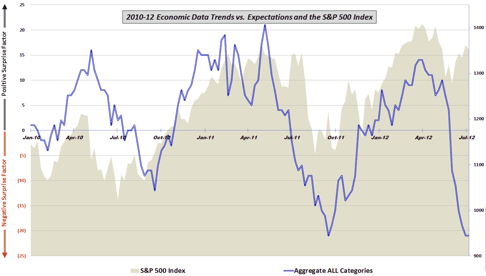

<!--yml

分类：未分类

日期：2024-05-18 16:26:46

-->

# VIX and More: 经济数据悬崖

> 来源：[`vixandmore.blogspot.com/2012/07/economic-data-cliff.html#0001-01-01`](http://vixandmore.blogspot.com/2012/07/economic-data-cliff.html#0001-01-01)

就在一个多月前，在[相对于预期而言，2009 年以来经济数据最糟糕的一周](http://vixandmore.blogspot.com/2012/06/worst-post-2009-week-in-economic-data.html)（不，我从未为生活写过标题……）中，我详细描述了相对于市场共识预期，经济数据迅速恶化的状况。

在讨论了非常令人失望的经济报告之后，我注意到了一个历史相似之处：

> “*历史上仅有的另一次，数据相对于预期如此之差的一周是在 2011 年 2 月中旬，当时数据正在从历史高点回撤，在大约 2 个半月之前，数据和股市达到顶峰并开始下跌。*”

五周后，原本看起来只是一个糟糕的一周，现在看起来像是两个月的可怕时期。下面的图表详细说明了自 2010 年初以来经济数据相对于预期的趋势。注意，过去两个月不仅包括经济数据三年来的最急剧短期下降，还反映了一个股市似乎与经济数据脱节的情况，这是自 2009 年股市开始反弹以来的第一次。普遍看法是，与经济现实的脱节只是推迟了股票的必然下跌，但也存在一种可能性，即股市价格开始反映年底或 2013 年初的经济复苏。

*[对于有兴趣了解更多关于此图表中包含的组成部分数据和所使用的方法的读者，建议查看下面的链接。对于那些希望了解更多关于构成我汇总数据计算的具体经济数据发布的人来说，请查看* [*图表周：2010 年的经济数据*](http://vixandmore.blogspot.com/2011/01/chart-of-week-year-in-economic-data.html)*。]*

相关文章：

**

*[来源：各种]*

**披露：** *无*
