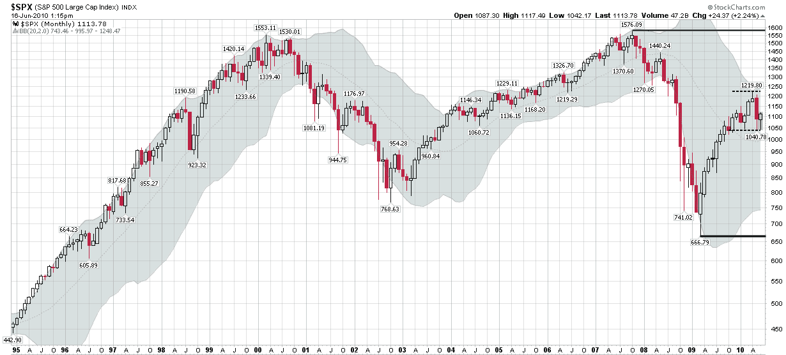

<!--yml

category: 未分类

date: 2024-05-18 17:07:53

-->

# VIX and More: The Elusive Trading Range

> 来源：[`vixandmore.blogspot.com/2010/06/elusive-trading-range.html#0001-01-01`](http://vixandmore.blogspot.com/2010/06/elusive-trading-range.html#0001-01-01)

在过去的一年或两年里，股市专家们让我想起了政治家，因为在思想上的两极化和观点呈现的激烈程度上，我看到了显著的增长。在某种程度上，这两者是相关的，分歧是可以理解的。强劲的宏观经济风潮正在吹拂，现在可能包含的极端情景比几年前要多得多。向更分散化的媒体转变也可能加强了这一趋势。

谈到政治，温和思考者的衰落至少可以部分地归因于那些倾向于将选民赶到对立阵营的机构和政治过程。在投资界，中间哲学的萎缩更难以理解。毕竟，如果两个同样极端的情景都有相同的概率，那么数学期望就是零，代表根本没有变化。

所有这些都让我想到了下面的图表，该图表使用了标普 500 指数的月 K 线。在这个图表中，五个强烈的趋势跃然纸上：

1.  1990 年代的牛市，以互联网狂潮为顶点

1.  2000-2002 由科技股引领的熊市

1.  2002-2007 的牛市，伴随着宽松的货币政策和格林斯潘的保险

1.  2007-2009 的熊市，房地产市场和金融业领跌

1.  2009-2010 在底部弹跳

仅凭图表，投资者当然可以被原谅，因为他们习惯于预期股市会在一个方向或另一个方向上强劲趋势。真相是，我们已经很久没有见过好的横盘市场了，投资者不再预期会出现交易区间。温和派要么慢慢破产，要么被流放到极端地区（如果我没记错的话，位于西伯利亚附近。）

因为没有人谈论交易区间，我以为我会冒险预测一下，SPX 666-1219 可能会在未来定义一个交易区间，但也许更重要的是，更紧的 1040-1219 范围也可能在令人惊讶的长时间内作为一个交易区间。仅仅因为有两个大的极端派别并不意味着多头和空头都是错的。

如果市场确实稳定在一个交易区间内，那么期权卖出策略可能会表现良好，尤其是如果高波动性持续存在的话。这意味着[覆盖式看涨期权](http://vixandmore.blogspot.com/search/label/covered%20calls)可能很快就会重新流行起来，更有经验的交易者会考虑像[宽跨式](http://vixandmore.blogspot.com/search/label/straddle)、[紧跨式](http://vixandmore.blogspot.com/search/label/strangle)、[蝴蝶式](http://vixandmore.blogspot.com/search/label/butterfly)和[秃鹰式](http://vixandmore.blogspot.com/search/label/condor)这样的更高级策略。

对于更多相关主题的内容，读者们被鼓励去查阅：

*[来源：StockCharts.com]*

***披露(s):*** *无*
