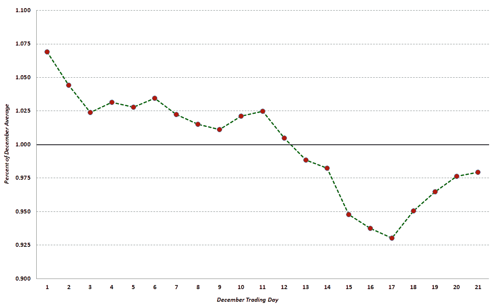
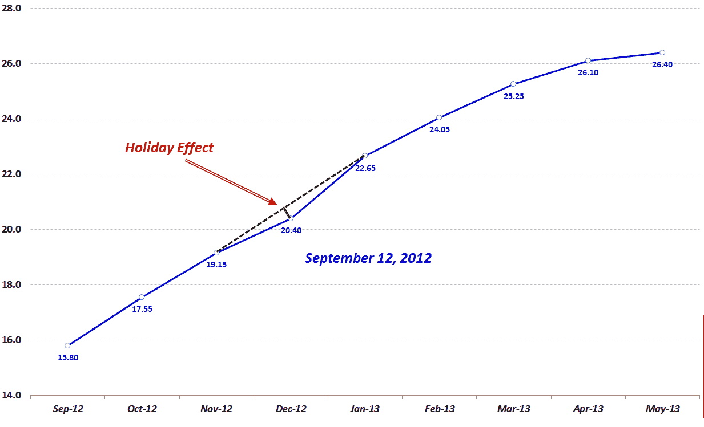
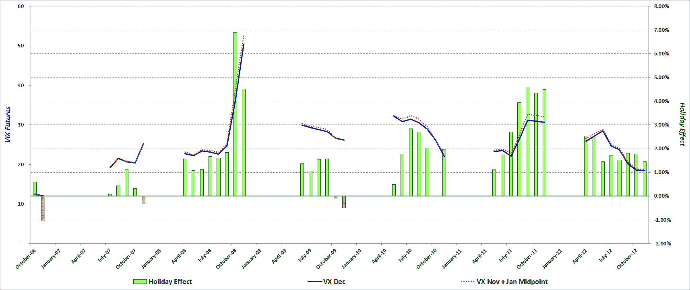

<!--yml

分类：未分类

日期：2024-05-18 16:12:20

-->

# VIX 与更多内容：VIX 期货中的假日效应演变

> 来源：[`vixandmore.blogspot.com/2013/11/the-evolution-of-holiday-effect-in-vix.html#0001-01-01`](http://vixandmore.blogspot.com/2013/11/the-evolution-of-holiday-effect-in-vix.html#0001-01-01)

以下内容最初发表于 2012 年 11 月的《Expiring Monthly: The Option Traders Journal》。考虑到即将到来的假日季节，我觉得这些内容可能适时。

随着交易日的减少以及历史记录显示股票上涨和波动性下降的趋势，年底总是呈现出引人入胜的交易机会集合。

与上述相关的一个现象是我所标记的“假日效应”，即 CBOE 波动率指数（VIX）12 月期货倾向于比 VIX11 月和 1 月期货的中点价格有折价。

本文提供了一些关于假日效应的历史分析，并分析了假日效应在过去几年中的表现和演变。

**VIX 指数的假日效应背景和上下文**

假日效应的部分解释蕴含在历史记录中。例如，在过去的二十年里，有八年 VIX 指数在 12 月份达到了年度低点。实际上，如以下图 1 所示，VIX 在 12 月的头 17 个交易日内呈现出明显的稳步下降趋势，该图使用 1990 年以来的每个交易日的标准化 VIX12 月数据进行比较。不出所料，这 17 个交易日的天数恰好与圣诞节前的典型 12 月交易日数相吻合。

*{图 1：1990-2011 年综合 12 月 VIX 指数（来源：CBOE 期货交易所，VIX 与更多内容）}*

读者还应注意，平均而言，VIX 的最大跌幅通常是从月中旬一直持续到圣诞节假期。

**12 月 VIX 期货角度**

大多数 VIX 交易员都知道，在 12 月，隐含波动性通常会下降，尤其是 VIX。因此，自 2004 年 VIX 期货推出以来，通常在 12 月份的 VIX 期货[期限结构](http://vixandmore.blogspot.com/search/label/term%20structure)曲线上会明显下降。下面是 2012 年 9 月 12 日 VIX 期货曲线的快照。在这里，我增加了一条虚线黑色线条，显示 12 月 VIX 期货的线性插值会是什么样子，绿色线条显示了该日期实际结算的 VIX 十二月期货价值 20.40 与来自 11 月和 1 月 VIX 期货合约的插值值 20.90 之间的 0.50 点差额。（除了 12 月 VIX 期货中的扭曲，通常使用第一个和第三个月的 VIX 期货进行线性插值可以很好地估计第二个月 VIX 期货的价值。）

图 2：2012 年 9 月 12 日显示假日效应的 VIX 期货曲线（来源：CBOE 期货交易所，VIX 与更多内容）

观察完整的历史数据记录，所有在 11 月、12 月和 1 月交易的期货的平均假日效应为 1.87%，这意味着 12 月 VIX 期货的平均值比由 11 月和 1 月 VIX 期货的线性插值预测的值低 1.87%。进一步分析显示，在所有交易日的 91%中，12 月 VIX 期货低于其 11 月和 1 月插值值。因此，假日效应是持续且显著的。

**十二月 VIX 期货的假日效应历史**

确定假日效应是否具有统计学意义是一个更加艰巨的任务，因为只有一个可以从 meaningful VIX futures data 中获取的假日季节。图 3 展示了自 2006 年 10 月 VIX 连续合约推出以来，每月的 VIX 十二月期货平均值（实心蓝线）以及 11 月和 1 月 VIX 期货的中点（虚线红线）。在这里，绿色条形图表示假日效应的百分比大小，符号相反（即，+2%的假日效应意味着 VIX 十二月期货将比从 11 月和 1 月期货得出的插值值低 2%）

图 3 展示了 2006-2012 年 VIX 十二月期货的假日效应（数据来源：CBOE 期货交易所，VIX 与更多内容）

**结论**

由于数据有限，很难得出结论，因此很诱惑去直观地查看数据，寻找未来可能重复出现的模式。显然，一个模式是 VIX 升高或上升似乎与更大的假日效应幅度相一致，而 VIX 降低或下降则与较小的假日效应一致。当试图确定假日季节剩余时间是否对假日效应的幅度有影响时，数据要说服力得多。虽然人们可能会预计假日效应在季节后期会变得更加放大，但支持这一假设的证据目前阶段很少。

总结来说，投资者已经很容易接受 12 月份较低的 VIX 是合理的，12 月份 VIX 期货期限结构向下的小幅波动反映了这种想法。至于这个[季节性异常](http://vixandmore.blogspot.com/search/label/seasonality)是否可以交易，目前还有有限的数据——更不用说一些非常异常的波动年份——从中可以发展并测试一个旨在捕捉假日效应的健壮 VIX 期货策略。

在余下的时间里，用假日效应来交换，即将到来的假日季节还因诸如财政悬崖截止日期和各种欧元区里程碑（均定于 2013 年初）等事务而变得复杂。实际上，可能找不到一个合理的等价物，因为 1999 年末的 Y2K 恐惧最终在 2000 年日历翻转时成为了一个波动性非事件。

尽管利用 2012 年假日效应的机会可能难以把握且转瞬即逝，但所有投资者都应该关注随着 2013 年的展开以及波动性预期随着新闻周期和日历的波动而涨跌的季节性波动周期。

相关文章：

其他从《Expiring Monthly》重新发布的文章：

***披露（s）：*** *无**
