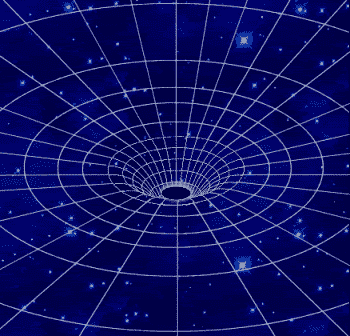

<!--yml

category: 未分类

date: 2024-05-18 18:48:18

-->

# VIX and More: The Fallacy of the Bearish First Five Days

> 来源：[`vixandmore.blogspot.com/2008/01/fallacy-of-bearish-first-five-days.html#0001-01-01`](http://vixandmore.blogspot.com/2008/01/fallacy-of-bearish-first-five-days.html#0001-01-01)

我首先要承认，我最喜欢浏览的交易书籍之一是《股票交易者年鉴》，该书由[杰弗里· Hirsch 和耶鲁· Hirsch](http://www.stocktradersalmanac.com/sta/home.do)编辑。这本年度经典 current version, [《股票交易者年鉴 2008》](http://www.amazon.com/Stock-Traders-Almanac-2008-Investor/dp/0470109858/ref=pd_bbs_sr_1?ie=UTF8&s=books&qid=1199805182&sr=8-1)，已经摆在了我桌上三个月了。

我提起这本书，是因为作者们在广泛传播“[一月晴雨表](http://www.investopedia.com/terms/j/januarybarometer.asp)”这一观念方面起了重要作用，该观念认为“一月如何，市场便如何”。虽然“一月晴雨表”这一观念至少可以追溯到 1972 年，但其推论，今天许多投资者都应该放在心上，即一月的头五天为整年趋势提供了一个有效的“早期预警系统”。

在我批评这两个观点之前，让我指出，关于一月是全年交易缩影的一般前提数据是有说服力的。使用标普 500 指数，一月晴雨表在过去 58 年中只出现了五个主要错误；而过去 36 次第一天开盘上涨，全年表现也上涨了。

但在你预期市场会被吸入黑洞而大量买入[QID](http://finance.google.com/finance?q=qid)之前，重要的是要认识到数据掩盖了年初开盘 particularly ugly 的情况，就像今年前四交易日（截至昨天），标普 500 指数下跌了 3.6%。

结果证明，自 1950 年以来，标普 500 指数只有两次开盘五天的表现比 2008 年更差：1978 年和 1991 年。然而，在这两种情况下，全年都实现了逆转并最终收涨。1978 年，标普 500 指数在前五天下跌了 4.7%，但其余年份表现上涨了 6.0%。1991 年的逆转更加戏剧化，任何当年持有纳斯达克股票的人（那年上涨了 56.8%）一定会印象深刻。1991 年前五天下跌了 4.6%，但标普 500 指数在当年剩余时间上涨了 32.5%。

如果一个人想要把分析扩展到自 1950 年以来最糟糕的一个月开盘情况，这四个月份的糟糕开盘也都在年底实现了逆转。1970 年，1 月份下跌了 7.6%，但整年表现上涨了 8.4%。1960 年，开盘下跌 7.1%，随后上涨 4.5%；1990 年开盘下跌 6.9%，随后上涨 0.3%；1978 年开盘下跌 6.2%，从 2 月到 12 月实现了 7.7%的逆转。

正如往常一样，在从这次分析中提取信息时要小心。在标普 500 指数（SPX）在 1 月下跌的 21 年中，全年下跌的有 10 次，上涨的有 11 次。结论是？如果上述数据中有任何值得记住的信息，那就是好的开始往往能够持续，糟糕的开始往往会有所逆转，而稍微下跌的开局则存在最大的风险演变成崩盘。
