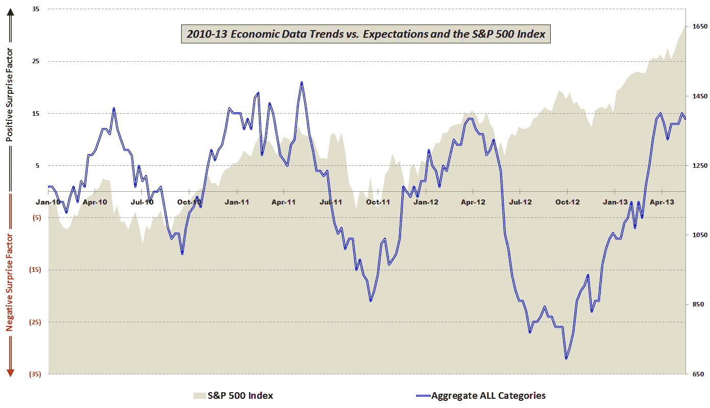
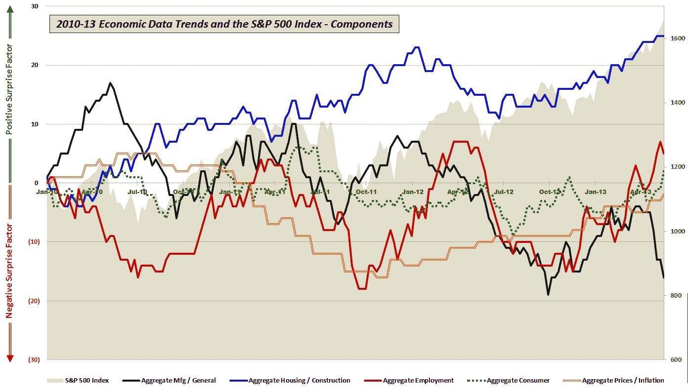

<!--yml

category: 未分类

date: 2024-05-18 16:16:28

-->

# VIX 和更多：美联储、量化宽松、经济和金发女郎 2.0

> 来源：[`vixandmore.blogspot.com/2013/05/the-fed-qe-economy-and-goldilocks-20.html#0001-01-01`](http://vixandmore.blogspot.com/2013/05/the-fed-qe-economy-and-goldilocks-20.html#0001-01-01)

担任中央银行家从来不是一件容易的事，而且在过去的五年左右，这项工作变得更加困难，但目前引导货币政策并在众多威胁经济稳定的因素中周旋的任务尤其令人望而却步。

以美联储为例。当前的政策声明要求每月购买 850 亿美元的债券，直到失业率降至 6.5%以下，只要通胀预期不超过 2.5%。

然而，在某个时候，美联储将不得不缩减其债券购买，并最终开始出售其部分债券持仓。关键问题在于何时开始改变政策方向，以及这些政策变化的分量会有多么剧烈。

在失业率和通胀率被视为决定政策调整时机和幅度的关键数据点的情况下，减缓并最终逆转量化宽松政策的任务在理论上似乎相当直接。

一个很大的问题是，失业率可能并不是衡量经济健康状况的好指标。下面的图表展示了过去三年半的经济数据报告与预期相比的情况。注意直到大约一年前，标普 500 指数的表现与经济数据是否超过或未达到共识预期之间存在非常强的相关性。当经济数据在九月底开始上升时，相关性重新出现，但当经济数据大约两个月前开始停滞时，新的分歧出现了，而股市却不断创新高。

*[来源：各种]*

观察经济数据的五个组成部分，可以看出过去八个月左右，住房/建筑、就业、消费者和价格/通胀方面呈现有利趋势。如下图所示，在过去五周中，一直低于预期的是制造业和一般经济数据，这一类别包括 GDP、ISM、工业生产、产能利用、耐用品、工厂订单、地区联邦指数、生产力等报告。

*[来源：各种]*

对于美联储来说，问题在于，尽管消费者、房地产/建筑和总体失业率都表明经济正在改善，但制造业部门以及就业指标如劳动力参与率（[官方 BLS 图表](http://data.bls.gov/timeseries/LNS11300000)）描绘出一幅持续的经济疲软图景。

作为一名投资者，你必须猜测美联储将如何处理这个不断发展的难题。我的一般感觉是，如果经济数据继续略低于预期，那么多头将会得到奖励，并帮助说服美联储维持或甚至增加债券购买是最好的政策方法——所有这些都应该对股市有利。如果经济数据，特别是就业成分，开始定期超过预期，那么我们很可能会得出结论，美联储将开始相对较快地去除量化宽松的安全网。在另一个极端，如果数据在未来大幅低于预期，更令人困惑的结论是，即使美联储的工具箱在扩大，其支撑经济的努力也最多只能产生暂时效果，并且也显示出递减的回报。对于投资者来说，未来数据的最佳位置——如果你愿意，可以说是“金发女孩区域”——可能是一系列接近失误，这将无限期地延长当前政策。

*[对于那些对图表中包含的组件数据以及所使用的方法感兴趣的读者，建议查看下面的链接。对于那些寻求更多关于构成我汇总数据计算的具体经济数据发布信息的人来说，请查看* [*图表一周：2010 年经济数据年度回顾*](http://vixandmore.blogspot.com/2011/01/chart-of-week-year-in-economic-data.html)*.]*

相关文章：

***披露(s):*** *无*
