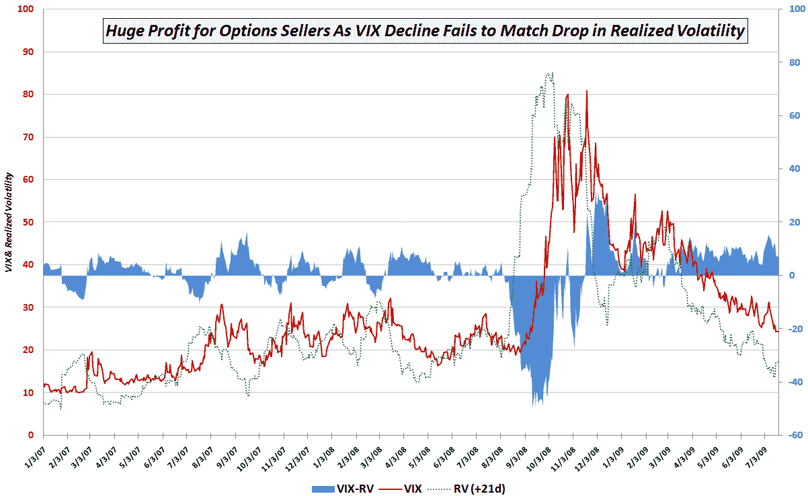

<!--yml

category: 未分类

date: 2024-05-18 17:33:12

-->

# VIX 和更多内容：VIX 与实际波动率之间的差距

> 来源：[`vixandmore.blogspot.com/2009/08/gap-between-vix-and-realized-volatility.html#0001-01-01`](http://vixandmore.blogspot.com/2009/08/gap-between-vix-and-realized-volatility.html#0001-01-01)

自 2008 年 11 月 20 日创下的 80.86 点收盘高点以来，CBOE 波动指数（VIX）一直在下降至其历史平均水平 20.22 点。尽管 VIX 的最初下跌使其迅速从 80 降至 40-50 点，但投资者需要一段时间才能确信 3 月份股票的低点就是底部。一旦市场共识开始建立，认为股市可能触底并出现历史性买入机会，VIX 开始稳步下降，一直跌至 20 多一点。

如下图所示，尽管 VIX（红线）下跌速度很快，但它并没有跟上实际波动率的下降（虚线绿色线）。该图表记录了每天的收盘 VIX 值以及计算未来 21 个交易日 21 天历史波动率得出的 21 天实际波动率（dotted green line）。这些计算允许期权买方或卖方确定 VIX（向前看 30 个日历日）对未来 21 个交易日或大约 30 个日历日的实际波动性的准确预测程度。差异（VIX-RV）以蓝色区域表示。

图表的关键结论之一是，在过去的 2 年半时间里，VIX 经常是一个对未来波动性的糟糕估计器。在 2008 年 10 月的金融危机期间，VIX 经常低估未来波动性 30-40 点。然而，自 2008 年 11 月以来，VIX 一直高估未来波动性。实际上，自 2 月 27 日以来，VIX 对未来波动性的预期首次低于 21 天后的实际波动性。

换句话说，如果你从 3 月份开始每天卖出 SPX 期权，预期的波动性的大幅下降几乎可以保证每一天都是盈利的一天。

*[虽然我在这里一般避免使用“实现波动率”这个术语，但它与[历史波动率](http://vixandmore.blogspot.com/search/label/historical%20volatility)、统计波动率和实际波动率是同义的。所有这些术语都反映了计算价格变动序列波动性的传统方法，本质上是通过取日价格变动相对于数据系列平均值的比率的自然对数来完成的。为了尽可能避免混淆，我将尝试在从特定日期向后查看时统一使用“历史波动率”，在从有更近历史数据可以从中推导计算的日期向前查看时统一使用“实现波动率”。记录在案，实际上有几种计算历史波动率的方法，总有一天我会着手写一系列关于历史波动率的帖子，从计算开始...]*

关于这个主题的相关文章，读者可以查看以下内容：

